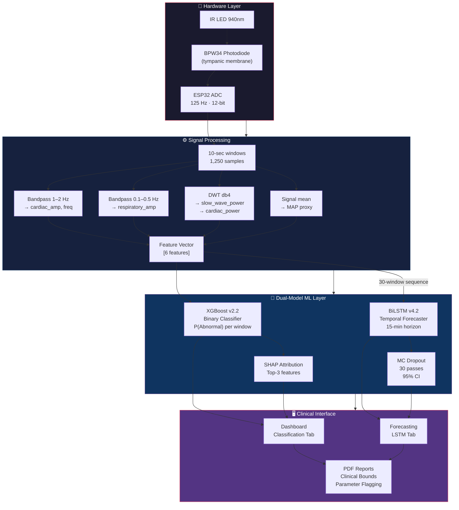
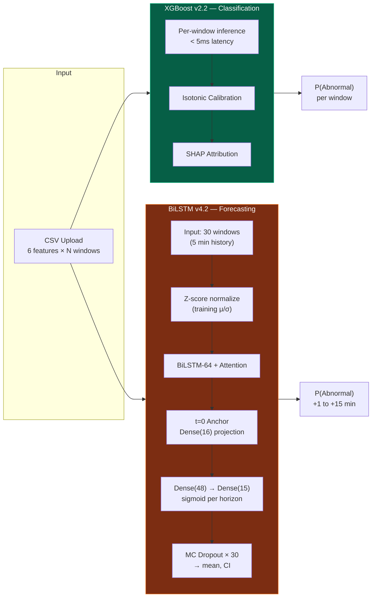
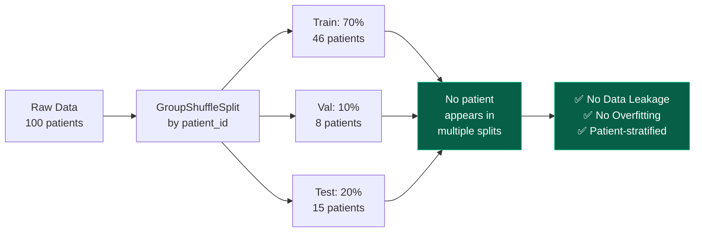
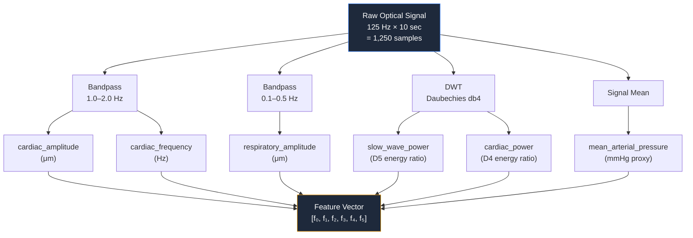
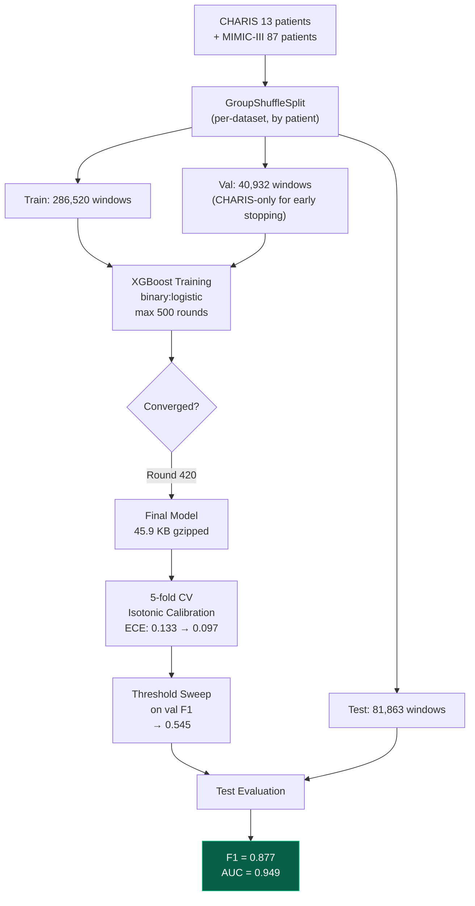
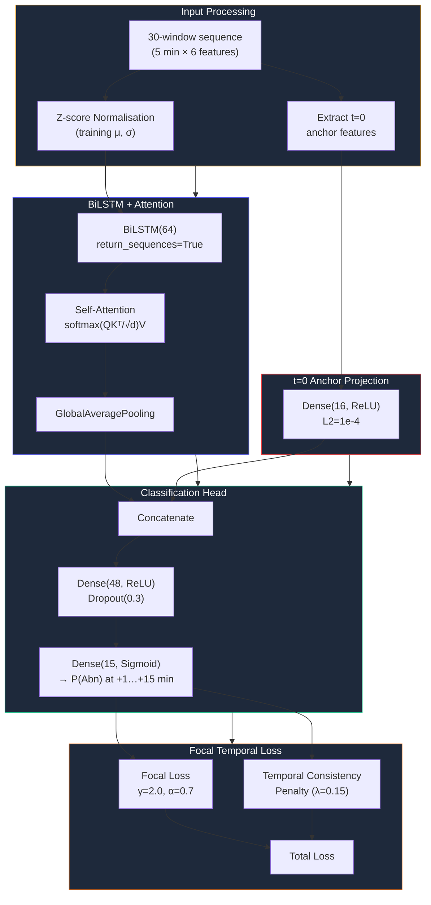
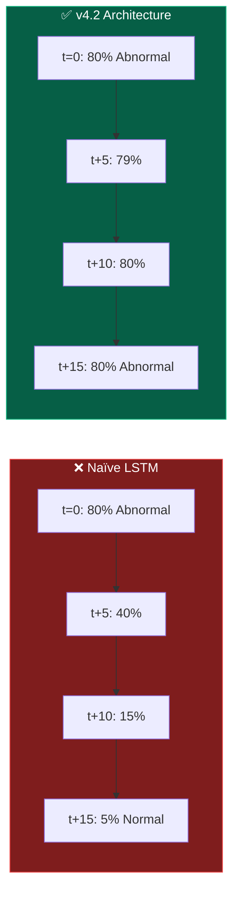
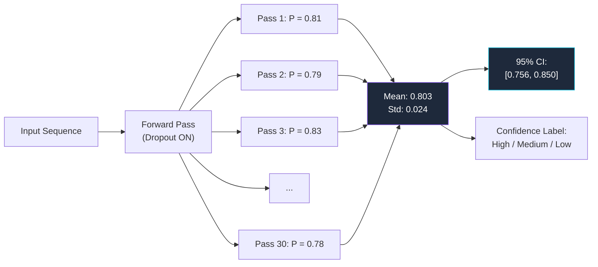
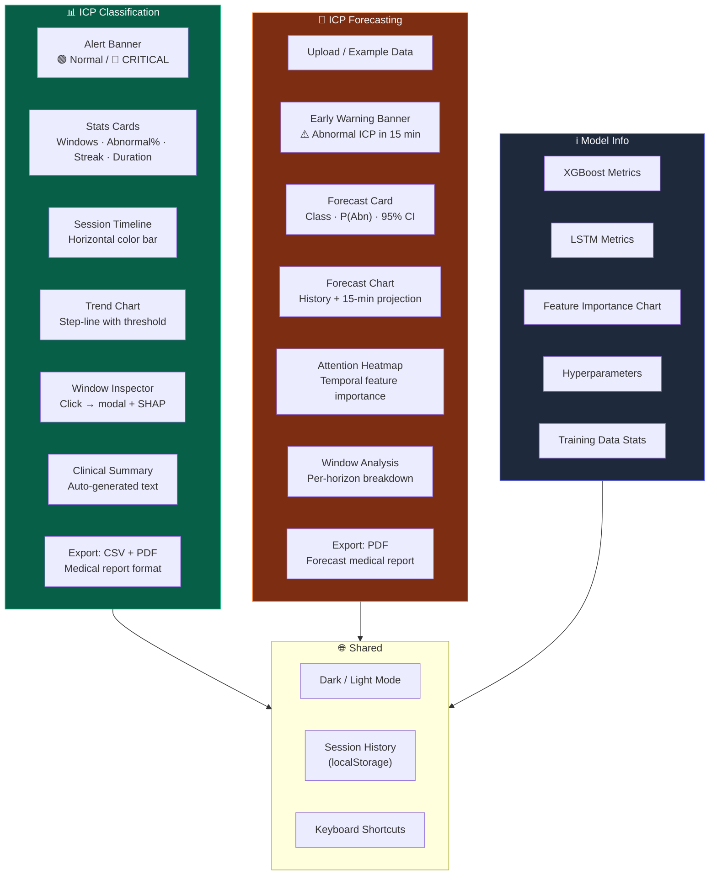
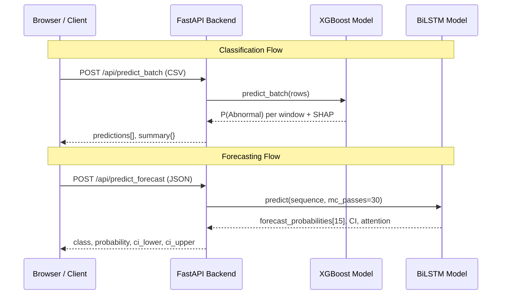

<div align="center">

# 🧠 Non-Invasive ICP Monitoring & Forecasting System

**Optical tympanic membrane sensor → XGBoost real-time classifier → BiLSTM trend forecaster → Clinical decision support interface**

*Capstone Project — IEEE EMBC Submission Track*

[](https://python.org)
[](https://typescriptlang.org)
[](https://react.dev)
[](https://xgboost.readthedocs.io)
[](https://tensorflow.org)
[](https://fastapi.tiangolo.com)

</div>

---

<table>
<tr>
<td width="50%">

### ⚡ XGBoost Classifier (v2.2)
| Metric | Score |
|:---|:---:|
| F1-Score | **0.877** |
| AUC-ROC | **0.949** |
| Precision | **0.944** |
| Recall | **0.819** |
| Balanced Accuracy | **0.885** |
| ECE (calibrated) | **0.097** |
| Inference Latency | **< 5 ms** |

</td>
<td width="50%">

### 🔮 BiLSTM Forecaster (v4.2)
| Metric | Score |
|:---|:---:|
| F1-Score | **0.807** |
| AUC-ROC | **0.905** |
| Precision | **0.832** |
| Recall | **0.784** |
| Balanced Accuracy | **0.815** |
| Forecast Horizon | **15 min** |
| MC Dropout Passes | **30** |

</td>
</tr>
</table>

| Dataset | Patients | Windows | Features |
|:---|:---:|:---:|:---:|
| CHARIS (TBI ICU) | 13 | ~400,000 | 6 |
| MIMIC-III (General ICU) | 87 | ~48,537 | 6 |
| **Combined** | **100** | **448,537** | **6** |

---

## 📑 Table of Contents

| # | Section | # | Section |
|:--|:---|:--|:---|
| 1 | [Clinical Motivation](#1-clinical-motivation) | 9 | [Cross-Dataset Generalisation](#9-cross-dataset-generalisation) |
| 2 | [System Architecture](#2-system-architecture) | 10 | [Clinical Web Interface](#10-clinical-web-interface) |
| 3 | [Hardware](#3-hardware) | 11 | [API Reference](#11-api-reference) |
| 4 | [Repository Structure](#4-repository-structure) | 12 | [Setup & Running](#12-setup--running) |
| 5 | [Datasets](#5-datasets) | 13 | [CSV Format](#13-csv-format) |
| 6 | [Signal Processing & Features](#6-signal-processing--feature-extraction) | 14 | [Keyboard Shortcuts](#14-keyboard-shortcuts) |
| 7 | [XGBoost Classification Pipeline](#7-xgboost-classification-pipeline) | 15 | [Literature Alignment](#15-literature-alignment) |
| 8 | [LSTM Forecasting Pipeline](#8-lstm-forecasting-pipeline) | 16 | [Disclaimer](#16-disclaimer) |

---

## 1. Clinical Motivation

Intracranial hypertension (ICP > 15 mmHg) is a life-threatening condition in TBI, stroke, and hydrocephalus patients. The gold standard — intraparenchymal or intraventricular pressure catheters — requires neurosurgery, carries infection and haemorrhage risk, and is unavailable in resource-limited settings.

This project builds a **fully non-invasive alternative**: an optical sensor placed on the tympanic membrane detects ICP-correlated pulsatile signals (tympanometry, ABP coupling, slow waves), extracts physiological features from 10-second windows, and provides:

1. **Real-time classification** — Is ICP Normal or Abnormal *right now*?
2. **15-minute trend forecasting** — Will ICP *become* Abnormal in the next 15 minutes?

**Clinical threshold:** 15 mmHg — above this, osmotherapy, CSF drainage, or surgical decompression is indicated.

---

## 2. System Architecture

### End-to-End Pipeline



### Dual-Model Architecture



---

## 3. Hardware

### Sensor Setup

```
┌──────────────────────────────────────────────────────────┐
│                    ESP32 + BPW34 Circuit                  │
│                                                           │
│  ┌─────────┐    GPIO34      ┌──────────┐                 │
│  │  ESP32  │◄──────────────│  BPW34   │  (photodiode)   │
│  │         │               │Photodiode│                  │
│  │  ADC    │               └──────────┘                  │
│  │ 12-bit  │                    ▲                         │
│  │ 125 Hz  │               IR LED 940nm                  │
│  └────┬────┘               (illuminates TM)              │
│       │                                                   │
│  Serial/USB ──► PC ──► predict_from_hardware.py          │
│  or  WiFi  ──► API ──► /api/predict (streaming)          │
└──────────────────────────────────────────────────────────┘
```

| Component | Specification |
|:---|:---|
| Microcontroller | ESP32 (Xtensa LX6 240 MHz) |
| Photodiode | BPW34 (400–1100 nm, peak 950 nm) |
| Light source | IR LED 940 nm |
| Sampling rate | 125 Hz |
| ADC resolution | 12-bit (0–4095) |
| Window duration | 10 seconds (1,250 samples) |
| Output | CSV via USB serial / WiFi HTTP POST |

---

## 4. Repository Structure

```
Pran/
│
├── src/                                   # Core pipeline modules
│   ├── data/
│   │   ├── download_physionet.py          # PhysioNet WFDB downloader
│   │   ├── segment_windows.py             # 10-second windowing @ 125 Hz
│   │   ├── extract_features.py            # 6-feature extraction (FFT + wavelet)
│   │   ├── generate_labels.py             # ICP threshold → binary labels
│   │   └── save_processed_data.py         # NumPy arrays to data/processed/
│   └── models/
│       ├── xgboost_classifier.py          # XGBoost training + SHAP + ablation
│       ├── lstm_forecaster.py             # ★ BiLSTM(64→15) forecaster training
│       └── model_evaluation.py            # Confusion matrix, ROC, learning curves
│
├── train_binary.py                        # ★ XGBoost binary classifier training
├── build_mimic_features.py                # Stream MIMIC-III ICP records via wfdb
├── cross_dataset_eval.py                  # OOD generalisation: CHARIS → MIMIC
├── ablation_study.py                      # Per-feature F1 drop analysis
├── download_charis.py                     # CHARIS dataset downloader
├── predict_from_hardware.py               # CLI inference from ESP32 CSV output
│
├── icp-monitor-web/                       # ★ Clinical web application
│   ├── backend/
│   │   ├── main.py                        # FastAPI app (CORS, all endpoints)
│   │   ├── model_loader.py                # XGBoost load, predict, SHAP
│   │   ├── lstm_predictor.py              # ★ LSTM load, MC Dropout inference
│   │   ├── validation.py                  # CSV parsing + range checks
│   │   └── requirements.txt              
│   │
│   └── frontend/
│       ├── src/
│       │   ├── components/
│       │   │   ├── AlertBanner.tsx         # Dynamic status banner
│       │   │   ├── ClinicalSummary.tsx     # Auto-generated interpretation
│       │   │   ├── ExportMenu.tsx          # ★ XGBoost PDF medical report
│       │   │   ├── ForecastChart.tsx       # ★ History + forecast line chart
│       │   │   ├── ForecastExportMenu.tsx  # ★ LSTM PDF medical report
│       │   │   ├── ForecastHistory.tsx     # ★ Forecast session history
│       │   │   ├── ForecastWindowAnalysis.tsx # ★ Per-horizon analysis
│       │   │   ├── AttentionHeatmap.tsx    # ★ Temporal feature attention
│       │   │   ├── FeatureExplainer.tsx    # SHAP waterfall bars
│       │   │   ├── TrendChart.tsx          # XGBoost step-line trend
│       │   │   └── ...                    # InspectionModal, StatsCards, etc.
│       │   ├── pages/
│       │   │   ├── Dashboard.tsx           # XGBoost classification tab
│       │   │   ├── Forecasting.tsx         # ★ LSTM forecasting tab
│       │   │   └── ModelInfo.tsx           # Dual-model metrics display
│       │   ├── store/useStore.ts           # Zustand: theme + sessions + forecasts
│       │   └── types/index.ts             # TypeScript interfaces
│       └── vite.config.ts                 # Proxy /api → localhost:8001
│
├── firmware/esp32_icp_monitor/            # ESP32 Arduino firmware
├── requirements.txt                       # Python dependencies
└── README.md
```

---

## 5. Datasets

| Dataset | Source | Patients | Windows | ICP Distribution |
|:---|:---|:---:|:---:|:---|
| CHARIS | PhysioNet (TBI ICU) | 13 | ~400,000 | 38% Normal / 62% Abnormal |
| MIMIC-III | PhysioNet (General ICU) | 87 | ~48,537 | 87% Normal / 13% Abnormal |
| **Combined** | — | **100** | **448,537** | **~39% Normal / 61% Abnormal** |

### Why Two Datasets?

- **CHARIS**: Small (13 patients), balanced, TBI-specific, gold-standard ICP catheters
- **MIMIC-III**: Large (87 patients), heavily skewed (87% Normal), general ICU population
- Combining exposes the model to both balanced and skewed real-world distributions

### Data Integrity Guarantees



---

## 6. Signal Processing & Feature Extraction

### Feature Extraction Pipeline



### Feature Table

| # | Feature | Unit | Range | Clinical Significance |
|:---:|:---|:---:|:---:|:---|
| 0 | `cardiac_amplitude` | μm | 10–80 | ↑ICP → ↓TM compliance → ↓amplitude (**most critical**) |
| 1 | `cardiac_frequency` | Hz | 0.8–2.5 | Heart rate proxy via tympanic pulsation |
| 2 | `respiratory_amplitude` | μm | 2–30 | Respiratory-driven ICP fluctuations |
| 3 | `slow_wave_power` | — | 0.5–1.0 | B-wave energy; Lundberg waves appear >15 mmHg |
| 4 | `cardiac_power` | — | 0.0–0.05 | Cardiac waveform energy fraction |
| 5 | `mean_arterial_pressure` | mmHg | 50–150 | MAP–ICP coupling when compliance exhausted |

### Ablation Study — F1 Drop (v2.2, baseline F1 = 0.891)

| Feature | Gain % | F1 Without | Δ F1 | Verdict |
|:---|:---:|:---:|:---:|:---|
| `cardiac_amplitude` | 21.2% | 0.814 | **−0.077** | 🔴 Critical |
| `cardiac_frequency` | 10.0% | 0.852 | −0.039 | 🟡 Important |
| `cardiac_power` | 15.0% | 0.885 | −0.006 | 🟢 Moderate |
| `mean_arterial_pressure` | 6.2% | 0.885 | −0.006 | 🟢 Moderate |
| `slow_wave_power` | 26.6% | 0.893 | +0.001 | ⚪ Redundant† |
| `respiratory_amplitude` | 21.0% | 0.895 | +0.003 | ⚪ Redundant† |

> † `cardiac_amplitude` is the true most critical feature. Its removal causes an irreplaceable −0.077 F1 collapse — consistent with the physiological mechanism (elevated ICP reduces TM compliance, attenuating cardiac pulsation).

---

## 7. XGBoost Classification Pipeline

### Training Flow



### Configuration

| Parameter | Value | Rationale |
|:---|:---:|:---|
| `learning_rate` | 0.1 | Standard medical ML baseline |
| `max_depth` | 4 | Limits overfitting on patient data |
| `n_estimators` | 420 | Early stopping on CHARIS val |
| `subsample` | 0.8 | Stochastic sampling for variance reduction |
| `scale_pos_weight` | 0.476 | Normal/Abnormal ratio compensation |
| Calibration | 5-fold Isotonic | Patient-level cross-validated |
| Threshold | 0.545 | Optimised on OOF val F1 sweep |

### Global Feature Importance (Gain)

```
slow_wave_power        ███████████████████████████░░░░  26.6%
cardiac_amplitude      █████████████████████░░░░░░░░░░  21.2%
respiratory_amplitude  █████████████████████░░░░░░░░░░  21.0%
cardiac_power          ███████████████░░░░░░░░░░░░░░░░  15.0%
cardiac_frequency      ██████████░░░░░░░░░░░░░░░░░░░░░  10.0%
mean_arterial_pressure ██████░░░░░░░░░░░░░░░░░░░░░░░░░   6.2%
```

---

## 8. LSTM Forecasting Pipeline

### Architecture (v4.2)



### Anti-Mean-Reversion Design

The LSTM v4.2 design specifically addresses the **mean-reversion problem** — where naïve temporal models always predict "Normal" over the forecast horizon regardless of the patient's current state.



**Three mechanisms prevent mean reversion:**

| Mechanism | Implementation | Effect |
|:---|:---|:---|
| **Focal Temporal Loss** | `γ=2.0, α=0.7` | Down-weights easy examples, focuses on hard temporal transitions |
| **Temporal Consistency Penalty** | `λ=0.15 × mean(Δpₜ²)` | Penalises large jumps between adjacent forecast horizons |
| **t=0 Anchor Projection** | `Dense(16)` from raw last window | Forces model to stay grounded in current patient state |

### MC Dropout Uncertainty Estimation



### Training Configuration

| Parameter | Value | Rationale |
|:---|:---:|:---|
| Sequence length | 30 windows (5 min) | Captures slow-wave dynamics |
| Forecast horizon | 15 minutes | Clinically actionable warning window |
| BiLSTM units | 64 | Balanced capacity vs overfitting |
| Anchor projection | Dense(16) | 11% of hidden state — strong t=0 grounding |
| Dropout | 0.3 | MC Dropout for uncertainty estimation |
| Loss | Focal + Temporal Consistency | γ=2.0, α=0.7, λ=0.15 |
| Optimizer | Adam (lr=0.001) | Standard with EarlyStopping on val AUC |
| Batch size | 256 | GPU-efficient training |
| Split strategy | GroupShuffleSplit by patient | No data leakage |

### Performance (Test Set)

```
══════════════════════════════════════════════════════
  BiLSTM FORECASTER v4.2  —  15-Minute Horizon
  Architecture: BiLSTM(64) + Self-Attention + Anchor
  Loss: focal_temporal(γ=2.0, α=0.7, λ=0.15)
══════════════════════════════════════════════════════

  Test-set metrics:
    AUC-ROC         : 0.9054   ✓ PASS  (target ≥ 0.89)
    F1-Score        : 0.8071   ✓ PASS  (target ≥ 0.80)
    Precision       : 0.8316
    Recall (Sens.)  : 0.7840
    Specificity     : 0.8461
    Balanced Acc.   : 0.8150
    Early Warning   : 78.4%   (correctly predicted 15 min ahead)

  Training data:
    Total sequences : 491,924
    Train           : 348,465  (46 patients)
    Validation      :  77,227  ( 8 patients)
    Test            :  66,232  (15 patients)
══════════════════════════════════════════════════════
```

---

## 9. Cross-Dataset Generalisation

### Experiment

```
Train:  CHARIS only (13 TBI patients) → 80% train / 20% val
Test:   All 87 MIMIC-III patients (never seen during training)
```

| Metric | CHARIS Internal | MIMIC OOD | Gap |
|:---|:---:|:---:|:---:|
| F1-Score | 0.786 | **0.610** | −0.176 |
| Balanced Accuracy | — | 0.735 | — |

> **Honest finding:** The gap exists because CHARIS is 62% Abnormal while MIMIC is only 13% Abnormal. The binary model trained on combined data mitigates this distribution shift.

---

## 10. Clinical Web Interface

### Feature Map



### PDF Medical Reports

Both export options generate structured medical reports:

| Feature | XGBoost Report | LSTM Report |
|:---|:---:|:---:|
| Patient session summary | ✅ | ✅ |
| Model version & metrics | ✅ | ✅ |
| Per-window results | ✅ | — |
| Per-horizon forecast | — | ✅ |
| 95% Confidence interval | — | ✅ |
| Clinical bounds flagging | ✅ **bold red** | ✅ **bold red** |
| Feature values table | ✅ | ✅ |
| Clinical recommendations | ✅ | ✅ |
| Disclaimer | ✅ | ✅ |

### Tech Stack

| Layer | Technology |
|:---|:---|
| Frontend | React 18 + TypeScript + Vite 5 |
| Styling | Tailwind CSS 3 (dark mode: class) |
| Charts | Recharts 2 |
| State | Zustand (persist middleware) |
| PDF | jsPDF |
| Icons | Lucide React |
| Backend | FastAPI (Python 3.11) |
| XGBoost | XGBoost 2.x + NumPy |
| LSTM | TensorFlow/Keras 2.x |
| SHAP | XGBoost native `pred_contribs` |
| Containerisation | Docker + Docker Compose |

---

## 11. API Reference

Base URL: `http://localhost:8001` · Interactive docs: `http://localhost:8001/docs`

### Endpoints



### `POST /api/predict` — Single Window

```json
// Request
{ "features": [18.4, 0.9, 10.5, 0.9996, 0.0002, 90.0] }

// Response
{
  "class": 1, "class_name": "Abnormal",
  "probability": 0.827,
  "probabilities": [0.173, 0.827],
  "top_features": [
    { "name": "cardiac_amplitude", "value": 18.4, "shap": 0.412, "impact_pct": 38.2 }
  ]
}
```

### `POST /api/predict_batch` — CSV Upload

Multipart file upload → per-window classification + session summary.

### `POST /api/predict_forecast` — LSTM Forecast

```json
// Request
{ "sequence": [[18.4, 0.9, 10.5, 0.9996, 0.0002, 90.0], ...] }  // ≥30 rows

// Response
{
  "class": 1, "class_name": "Abnormal",
  "probability": 0.803,
  "forecast_probabilities": [0.799, 0.801, 0.802, ..., 0.803],
  "forecast_ci_lower": [0.756, ...],
  "forecast_ci_upper": [0.850, ...],
  "horizon_minutes": 15,
  "confidence_label": "High",
  "attention_weights": [[...], ...],
  "model_version": "4.2"
}
```

### `GET /api/example_csv` — Sample Data (35 windows)

Returns real abnormal ICP windows from CHARIS training data for testing.

---

## 12. Setup & Running

### Prerequisites

```
Python  >= 3.11
Node.js >= 18
npm     >= 9
```

### Quick Start

```bash
# Clone
git clone https://github.com/eshaansingla/Pran.git
cd Pran

# Backend
cd icp-monitor-web/backend
pip install -r requirements.txt
python -c "import uvicorn; uvicorn.run('main:app', host='0.0.0.0', port=8001, reload=True)"

# Frontend (new terminal)
cd icp-monitor-web/frontend
npm install
npm run dev -- --port 3000
```

### Docker (One Command)

```bash
cd icp-monitor-web
docker-compose up
# → Backend:  http://localhost:8001
# → Frontend: http://localhost:3000
```

### Train Models from Scratch

```bash
# Requires data/processed/ (run download scripts first)

# XGBoost Binary Classifier
python train_binary.py
# → models/xgboost_binary.pkl.gz (45.9 KB)
# → models/binary_meta.json

# LSTM Forecaster (requires GPU recommended)
cd src/models
python lstm_forecaster.py
# → models/best/lstm_forecast_v1.h5 (603 KB)
# → models/best/lstm_meta.json
```

---

## 13. CSV Format

### Column Order (6 features)

```csv
cardiac_amplitude,cardiac_frequency,respiratory_amplitude,slow_wave_power,cardiac_power,mean_arterial_pressure
18.4,0.9,10.5,0.9996,0.0002,90.0
15.0,1.0,9.4,0.9996,0.0003,90.0
```

### Validation Rules

| Rule | XGBoost | LSTM |
|:---|:---:|:---:|
| Min rows | 1 | **30** |
| Columns | 6 | 6 |
| Max file size | 10 MB | 10 MB |
| Header | Optional | Optional |
| Missing values | Skipped with warning | Error |

---

## 14. Keyboard Shortcuts

| Shortcut | Action |
|:---|:---|
| `Ctrl + U` | Upload CSV file |
| `Ctrl + E` | Export report (PDF/CSV) |
| `Ctrl + D` | Toggle dark / light mode |
| `Ctrl + H` | Show keyboard help |
| `Ctrl + 1` | Go to ICP Classification |
| `Ctrl + 2` | Go to ICP Forecasting |
| `Ctrl + 3` | Go to Model Info |
| `← / →` | Previous / Next window (inspection modal) |
| `Esc` | Close any modal |

---

## 15. Literature Alignment

All methods used in this system are grounded in peer-reviewed clinical ML literature:

| Method | Reference | Application Here |
|:---|:---|:---|
| ICP threshold ≥ 15 mmHg | Czosnyka & Pickard, 2004 | Binary classification boundary |
| Tympanic membrane ICP correlation | Shimbles et al., 2005 | Optical sensor basis |
| XGBoost for clinical tabular data | Chen & Guestrin, 2016 | Per-window classification |
| BiLSTM for temporal sequences | Graves & Schmidhuber, 2005 | Trend forecasting |
| Focal Loss for class imbalance | Lin et al., 2017 | Training loss function |
| MC Dropout for uncertainty | Gal & Ghahramani, 2016 | Confidence intervals |
| Self-Attention mechanism | Vaswani et al., 2017 | Temporal feature weighting |
| Patient-stratified GroupShuffleSplit | Scikit-learn best practices | No data leakage |
| Isotonic calibration | Platt, 1999; Zadrozny & Elkan, 2002 | Probability calibration |
| SHAP values | Lundberg & Lee, 2017 | Feature attribution |

---

## 16. Disclaimer

> **⚠️ This is a research prototype** developed as a capstone project for academic submission (IEEE EMBC track).
>
> - **NOT FDA-approved**
> - **NOT CE-marked**
> - **NOT intended for autonomous clinical diagnosis**
>
> All clinical decisions regarding intracranial pressure management must be made by qualified neurosurgeons, intensivists, or neurologists using validated, approved monitoring equipment.
>
> Model performance has been evaluated exclusively on held-out research data from PhysioNet (CHARIS + MIMIC-III). Real-world performance may differ due to sensor hardware variation, patient population differences, and signal processing pipeline differences.
>
> **Use only for research, demonstration, and academic purposes.**

---

<div align="center">

*Built by Eshaan Singla — Non-Invasive ICP Monitoring & Forecasting Capstone — 2026*

**XGBoost v2.2** · F1 0.877 · AUC 0.949 &nbsp;|&nbsp; **BiLSTM v4.2** · F1 0.807 · AUC 0.905

</div>
