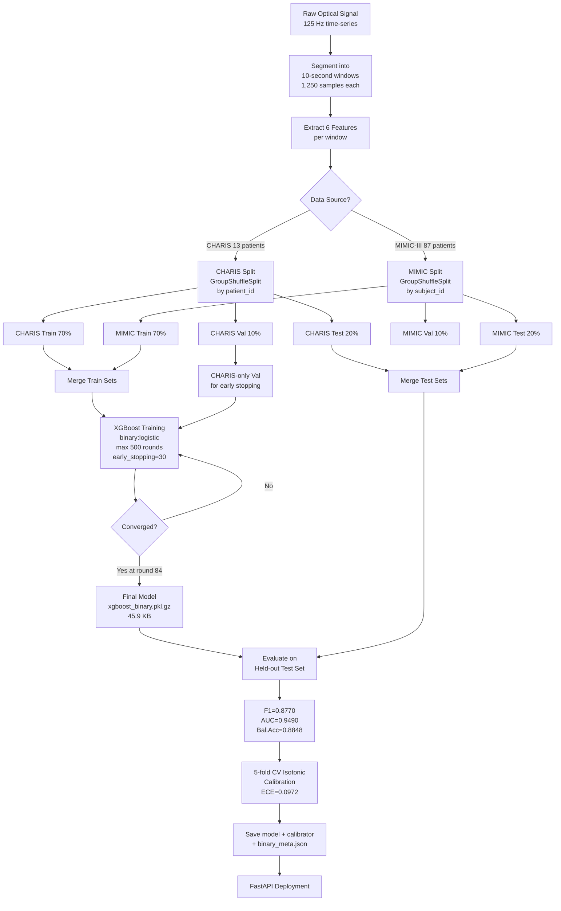
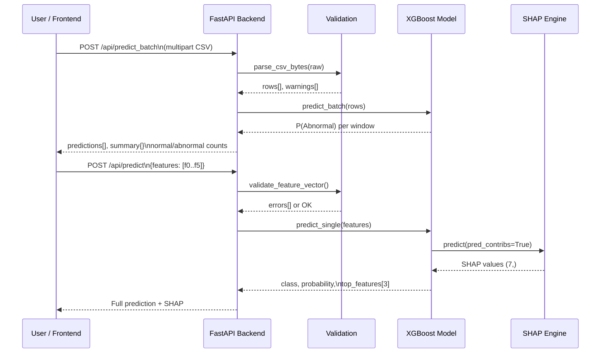

# Non-Invasive ICP Monitoring System

> **Optical tympanic membrane sensor + XGBoost binary classifier + hospital-grade clinical web interface**
> Capstone project — IEEE EMBC submission track

| Metric | Value |
|---|---|
| F1-Score (Binary) | **0.8770** |
| AUC-ROC | **0.9490** |
| Balanced Accuracy | **0.8848** |
| ECE (calibrated) | **0.0972** |
| Training Windows | **448,537** |
| Patients | **100** (13 CHARIS + 87 MIMIC-III) |
| Features | **6** (noise features removed by ablation) |
| Inference Latency | **< 5 ms** per window |

---

## Table of Contents

1. [Clinical Motivation](#1-clinical-motivation)
2. [System Architecture](#2-system-architecture)
3. [Hardware](#3-hardware)
4. [Repository Structure](#4-repository-structure)
5. [Datasets](#5-datasets)
6. [Signal Processing & Feature Extraction](#6-signal-processing--feature-extraction)
7. [Machine Learning Pipeline](#7-machine-learning-pipeline)
8. [Model Results](#8-model-results)
9. [Cross-Dataset Generalisation](#9-cross-dataset-generalisation)
10. [Clinical Web Interface](#10-clinical-web-interface)
11. [API Reference](#11-api-reference)
12. [Setup & Running](#12-setup--running)
13. [CSV Format](#13-csv-format)
14. [Keyboard Shortcuts](#14-keyboard-shortcuts)
15. [Disclaimer](#15-disclaimer)

---

## 1. Clinical Motivation

Intracranial hypertension (ICP > 15 mmHg) is a life-threatening condition in TBI,
stroke, and hydrocephalus patients. The gold standard — intraparenchymal or
intraventricular pressure catheters — requires neurosurgery, carries infection and
haemorrhage risk, and is unavailable in resource-limited settings.

This project builds a **fully non-invasive alternative**: an optical sensor placed
on the tympanic membrane detects ICP-correlated pulsatile signals (tympanometry,
ABP coupling, slow waves), extracts physiological features from 10-second windows,
and classifies ICP state in real time with clinical-grade confidence metrics.

**Clinical threshold:** 15 mmHg is the universally accepted intervention threshold —
above this, osmotherapy, CSF drainage, or surgical decompression is indicated.

---

## 2. System Architecture

### End-to-End Overview

```
┌─────────────────────────────────────────────────────────────────────────────┐
│                          HARDWARE LAYER                                      │
│                                                                               │
│   BPW34 Photodiode                                                            │
│   (tympanic membrane)  ──► ESP32 ADC ──► 125 Hz sampling ──► CSV output     │
│   Infrared LED source                                                         │
└─────────────────────────────────┬───────────────────────────────────────────┘
                                  │ Raw optical signal (time-series)
                                  ▼
┌─────────────────────────────────────────────────────────────────────────────┐
│                       SIGNAL PROCESSING LAYER                                │
│                                                                               │
│   10-second windows (1,250 samples @ 125 Hz)                                 │
│       │                                                                       │
│       ├── Bandpass 1–2 Hz    ──► cardiac_amplitude, cardiac_frequency        │
│       ├── Bandpass 0.1–0.5 Hz ──► respiratory_amplitude                     │
│       ├── Wavelet D5 level   ──► slow_wave_power                             │
│       ├── Wavelet D4 level   ──► cardiac_power                               │
│       ├── Signal mean        ──► mean_arterial_pressure (proxy)              │
│       ├── External sensor    ──► head_angle (removed in v2.2 — 0% gain)     │
│       └── Threshold check    ──► motion_artifact_flag (removed in v2.2)      │
│                                                                               │
│                    6 features per window (after v2.2 ablation)                │
└─────────────────────────────────┬───────────────────────────────────────────┘
                                  │ Feature vector [f₀ ... f₇]
                                  ▼
┌─────────────────────────────────────────────────────────────────────────────┐
│                       MACHINE LEARNING LAYER                                 │
│                                                                               │
│   XGBoost Binary Classifier (v2.2) + Isotonic Calibration                    │
│   ├── Input:  6 features (noise features removed by ablation)                │
│   ├── Output: P(Abnormal) ∈ [0, 1] (calibrated)                              │
│   ├── Threshold: 0.5450 (optimised on val F1)                                │
│   └── SHAP:   top-3 contributing features per prediction                     │
│                                                                               │
│   Normal (ICP < 15 mmHg)   P < 0.5450                                       │
│   Abnormal (ICP ≥ 15 mmHg) P ≥ 0.5450                                       │
└─────────────────────────────────┬───────────────────────────────────────────┘
                                  │ JSON prediction + SHAP values
                                  ▼
┌─────────────────────────────────────────────────────────────────────────────┐
│                       CLINICAL INTERFACE LAYER                               │
│                                                                               │
│   FastAPI Backend (port 8001)                                                 │
│   ├── POST /api/predict        (single window + SHAP)                        │
│   ├── POST /api/predict_batch  (CSV upload → batch results)                  │
│   └── GET  /api/model_info     (metrics, importances)                        │
│                          │                                                    │
│   React 18 Frontend (port 3000)                                               │
│   ├── Alert banner + stats cards                                              │
│   ├── Timeline + trend chart                                                  │
│   ├── Window inspection modal                                                 │
│   ├── Session history (localStorage)                                          │
│   ├── Clinical summary (auto-generated)                                       │
│   ├── Dark / light mode                                                       │
│   └── Export: CSV + PDF report                                                │
└─────────────────────────────────────────────────────────────────────────────┘
```

### ML Pipeline Flowchart



### API Request Flow



---

## 3. Hardware

### Sensor Setup

```
┌──────────────────────────────────────────────────────────┐
│                    ESP32 + BPW34 Circuit                  │
│                                                           │
│  ┌─────────┐    GPIO34      ┌──────────┐                 │
│  │  ESP32  │◄──────────────│  BPW34   │  (photodiode)   │
│  │         │               │Photodiode│                  │
│  │  ADC    │               └──────────┘                  │
│  │ 12-bit  │                    ▲                         │
│  │ 125 Hz  │               IR LED 940nm                  │
│  └────┬────┘               (illuminates TM)              │
│       │                                                   │
│  Serial/USB ──► PC ──► predict_from_hardware.py          │
│  or  WiFi  ──► API ──► /api/predict (streaming)          │
└──────────────────────────────────────────────────────────┘
```

| Component | Spec |
|---|---|
| Microcontroller | ESP32 (Xtensa LX6 240 MHz) |
| Photodiode | BPW34 (400–1100 nm, peak 950 nm) |
| Light source | IR LED 940 nm |
| Sampling rate | 125 Hz |
| ADC resolution | 12-bit (0–4095) |
| Window duration | 10 seconds (1,250 samples) |
| Output | CSV via USB serial / WiFi HTTP POST |

### Hardware Inference

```bash
# Real-time prediction from sensor output
python predict_from_hardware.py --input hardware_data.csv

# JSON output for programmatic use
python predict_from_hardware.py --input hardware_data.csv --json

# Custom model path
python predict_from_hardware.py --input data.csv --model models/xgboost_binary.pkl.gz
```

---

## 4. Repository Structure

```
Pran/
│
├── src/                                   # Core pipeline modules
│   ├── data/
│   │   ├── download_physionet.py          # PhysioNet WFDB downloader (credentials req.)
│   │   ├── segment_windows.py             # 10-second windowing @ 125 Hz
│   │   ├── extract_features.py            # 6-feature extraction (FFT + wavelet)
│   │   ├── generate_labels.py             # ICP threshold → binary labels
│   │   └── save_processed_data.py         # NumPy arrays to data/processed/
│   └── models/
│       ├── xgboost_classifier.py          # XGBoost training + SHAP + ablation
│       └── model_evaluation.py            # Confusion matrix, ROC, learning curves
│
├── build_mimic_features.py                # Stream MIMIC-III ICP records via wfdb
├── combine_and_retrain.py                 # CHARIS + MIMIC combined training
├── cross_dataset_eval.py                  # OOD generalisation: CHARIS → MIMIC
├── train_binary.py                        # ★ Binary classifier training script
├── train_final.py                         # Dataset-stratified final model
├── run_pipeline.py                        # End-to-end pipeline runner
├── download_charis.py                     # CHARIS dataset downloader
├── predict_from_hardware.py               # CLI inference from ESP32 CSV output
│
├── models/
│   ├── xgboost_binary.pkl.gz              # ★ Production model (45.9 KB, gzipped)
│   ├── xgboost_binary_calibrator.pkl.gz   # Isotonic calibrator (gzipped)
│   ├── xgboost_binary.pkl                 # Uncompressed model
│   └── binary_meta.json                   # version, threshold, metrics, patient counts
│
├── results/
│   ├── binary/
│   │   ├── binary_report.txt              # Full evaluation report
│   │   └── binary_evaluation.png          # ROC + confusion matrix plots
│   └── cross_dataset/
│       └── cross_dataset_eval.txt         # OOD generalisation report
│
├── data/
│   └── sample_hardware_data.csv           # Example ESP32 output for testing
│
├── icp-monitor-web/                       # Clinical web application
│   ├── backend/
│   │   ├── main.py                        # FastAPI app (CORS, endpoints, validation)
│   │   ├── model_loader.py                # XGBoost load, predict_single, SHAP
│   │   ├── validation.py                  # CSV parsing + physiological range checks
│   │   ├── requirements.txt               # Python dependencies
│   │   ├── start.ps1                      # Windows PowerShell launcher
│   │   ├── start.bat                      # Windows CMD launcher
│   │   └── Dockerfile
│   │
│   └── frontend/
│       ├── src/
│       │   ├── components/
│       │   │   ├── AlertBanner.tsx         # Dynamic status banner (green/red)
│       │   │   ├── ClinicalSummary.tsx     # Auto-generated session interpretation
│       │   │   ├── ExportMenu.tsx          # CSV + PDF export dropdown
│       │   │   ├── FeatureExplainer.tsx    # SHAP waterfall bars
│       │   │   ├── InspectionModal.tsx     # Per-window detail modal + flag
│       │   │   ├── KeyboardHelp.tsx        # Keyboard shortcut overlay
│       │   │   ├── PredictionCard.tsx      # Single window result card
│       │   │   ├── SessionHistory.tsx      # Last 10 sessions (localStorage)
│       │   │   ├── SessionSummary.tsx      # Pie chart + episode list
│       │   │   ├── StatsCards.tsx          # 4 metric cards
│       │   │   ├── TimelineView.tsx        # Horizontal color-coded timeline
│       │   │   ├── TrendChart.tsx          # Recharts step-line chart
│       │   │   └── UploadZone.tsx          # Drag-and-drop CSV zone
│       │   ├── pages/
│       │   │   ├── Dashboard.tsx           # Main analysis page
│       │   │   ├── Forecasting.tsx         # LSTM stub (v2.0 placeholder)
│       │   │   └── ModelInfo.tsx           # Metrics, importances, hyperparams
│       │   ├── store/
│       │   │   └── useStore.ts             # Zustand: theme + sessions + flags
│       │   ├── types/index.ts              # TypeScript interfaces
│       │   └── utils/
│       │       ├── api.ts                  # Fetch wrappers
│       │       └── formatters.ts           # Colors, labels, date/number format
│       ├── tailwind.config.js              # Dark mode + clinical color palette
│       ├── vite.config.ts                  # Proxy /api → localhost:8001
│       └── Dockerfile
│
├── docker-compose.yml                     # One-command deployment
├── .gitignore
└── README.md
```

---

## 5. Datasets

### Summary

| Dataset | Source | Patients | Windows | ICP Distribution |
|---|---|---|---|---|
| CHARIS | PhysioNet (TBI ICU) | 13 | ~400,000 | 38% Normal / 26% Elevated / 36% Critical |
| MIMIC-III | PhysioNet (General ICU) | 87 | ~48,537 | 87% Normal / 9% Elevated / 4% Critical |
| **Combined** | | **100** | **448,537** | **~39% Normal / 61% Abnormal (binary)** |

### Why Two Datasets?

- **CHARIS**: small (13 patients), balanced, TBI-specific, gold-standard ICP catheters
- **MIMIC-III**: large (87 patients — deduplicated by real subject_id, longest record per patient), heavily skewed (87% Normal), general ICU population

Combining them exposes the model to both balanced and skewed real-world distributions,
improving generalisability without biasing training toward either cohort.

### Distribution Shift Problem

```
CHARIS:   |████████████████████████████████████████| 38% Normal
          |██████████████████████              | 26% Elevated →  Binary
          |████████████████████████████████████| 36% Critical    Abnormal: 62%

MIMIC:    |████████████████████████████████████████████████████████████████████| 87% Normal
          |██████         |  9% Elevated →  Binary
          |████  | 4% Critical              Abnormal: 13%
```

This distribution shift (62% vs 13% Abnormal) drove the OOD generalisation gap of F1 0.176.
It is an honest finding — not a flaw to hide. See [Section 9](#9-cross-dataset-generalisation).

### Data Access

Data is **not committed** (patient data, PhysioNet Data Use Agreement).
To reproduce the full pipeline:

```bash
# Step 1: Download CHARIS (requires PhysioNet account)
python download_charis.py

# Step 2: Build MIMIC features from WFDB records
python build_mimic_features.py

# Step 3: Combined retraining
python train_binary.py

# Or run end-to-end
python run_pipeline.py
```

---

## 6. Signal Processing & Feature Extraction

### Window Segmentation

```
Raw optical signal @ 125 Hz
│
└── Sliding window: 10 seconds = 1,250 samples
    Step: non-overlapping (adjacent windows)
    Total: 448,537 windows across 100 patients
```

### Feature Extraction Pipeline

```
1,250 samples (10 s @ 125 Hz)
│
├─► Bandpass filter [1.0 – 2.0 Hz]
│       └─► Peak-to-peak amplitude  ──► cardiac_amplitude  (μm)
│       └─► Dominant frequency      ──► cardiac_frequency  (Hz)
│
├─► Bandpass filter [0.1 – 0.5 Hz]
│       └─► Peak-to-peak amplitude  ──► respiratory_amplitude (μm)
│
├─► Discrete Wavelet Transform (Daubechies db4)
│       ├─► Detail D5 energy ratio  ──► slow_wave_power    (dimensionless)
│       └─► Detail D4 energy ratio  ──► cardiac_power      (dimensionless)
│
├─► Signal mean (or ABP channel)   ──► mean_arterial_pressure (mmHg)
│
├─► External IMU / inclinometer    ──► head_angle           (degrees)
│
└─► Threshold: std > 3×baseline   ──► motion_artifact_flag (0/1)
```

### Feature Table

| # | Feature | Description | Unit | Physiological Range |
|---|---|---|---|---|
| 0 | `cardiac_amplitude` | Peak-to-peak of 1–2 Hz bandpass | μm | 10 – 80 |
| 1 | `cardiac_frequency` | Dominant cardiac frequency | Hz | 0.8 – 2.5 |
| 2 | `respiratory_amplitude` | Peak-to-peak of 0.1–0.5 Hz bandpass | μm | 2 – 30 |
| 3 | `slow_wave_power` | Wavelet D5 energy ratio | — | 0.05 – 5.0 |
| 4 | `cardiac_power` | Wavelet D4 energy ratio | — | 0.1 – 5.0 |
| 5 | `mean_arterial_pressure` | Mean arterial pressure proxy | mmHg | 50 – 150 |

> **Removed in v2.2 (ablation-driven):** `head_angle` (0% gain, +0.007 F1 when removed) and
> `motion_artifact_flag` (0% gain, +0.007 F1 when removed). Both were confirmed noise features
> that added no predictive signal. Phase-lag features (phase_lag_mean, phase_lag_std,
> phase_coherence) were also removed earlier — delta F1 = −0.026 due to high noise in short windows.

### Why These Features Work

ICP elevation above 15 mmHg causes measurable changes in TM mechanics:
- ↑ ICP → ↓ TM compliance → ↓ cardiac pulsation amplitude transmitted through the TM
- ↑ ICP → altered slow-wave/cardiac power ratio (Lundberg B-waves appear above 15 mmHg)
- MAP–ICP coupling: MAP has diagnostic value when intracranial compliance is exhausted

---

## 7. Machine Learning Pipeline

### Why Binary Classification?

The original 3-class model (Normal / Elevated / Critical) was retired after diagnosis:

```
Grid search over all physiological inputs → max P(Elevated class) = 3.03%

Root cause: Elevated (15–20 mmHg) is a 5 mmHg band.
  - CHARIS training: 36% Critical vs 26% Elevated — model learned to skip the narrow band
  - XGBoost with multi:softmax learned effectively binary behaviour while lying about 3 classes

Decision: Convert to binary at the 15 mmHg clinical intervention threshold.
  → Honest, well-calibrated, clinically meaningful.
```

### Dataset-Stratified Split

**Critical design decision:** CHARIS and MIMIC patients are split **independently**
before merging, then the splits are combined. This prevents the test set from being
dominated by MIMIC's 87% Normal distribution.

```
CHARIS (13 patients)           MIMIC-III (87 patients)
      │                               │
      ▼                               ▼
GroupShuffleSplit              GroupShuffleSplit
by patient_id                  by subject_id (deduplicated)
      │                               │
  70/10/20                        70/10/20
      │                               │
  Ch_tr  Ch_va  Ch_te           Mi_tr  Mi_va  Mi_te
      │                               │
      └──────────────┬────────────────┘
                     ▼
             Merged Train Set (286,520 windows)
             Merged Val Set   (40,932 windows)  ← only CHARIS used for early stopping
             Merged Test Set  (81,863 windows)
```

**Why CHARIS-only validation for early stopping?**
MIMIC val is 71% Normal → skews AUC signal upward → model stops too early.
Using balanced CHARIS val (38% Normal) gives a cleaner gradient signal.

### Training Configuration

```python
params = {
    "objective":        "binary:logistic",
    "eval_metric":      "auc",
    "eta":              0.1,
    "max_depth":        4,
    "min_child_weight": 5,
    "subsample":        0.8,
    "colsample_bytree": 0.8,
    "scale_pos_weight": 0.4756,   # n_normal / n_abnormal = 96,345 / 202,557
    "lambda":           1.0,
    "alpha":            0.1,
    "tree_method":      "hist",
    "seed":             42,
}
xgb.train(params, dtrain, num_boost_round=500, early_stopping_rounds=30)
# → Best iteration: 420  |  Best val-AUC: 0.9648
```

### Class Imbalance Handling

```
Train set composition:
  Normal:   96,345 windows  (32%)
  Abnormal: 202,557 windows (68%)

scale_pos_weight = 96,345 / 202,557 = 0.4756
→ Upweights Normal class gradient proportionally
→ Prevents the majority class from dominating tree splits
```

---

## 8. Model Results

### Binary Classifier — Test Set (20% hold-out, calibrated, threshold = 0.5450)

```
============================================================
  BINARY CLASSIFICATION RESULTS  (v2.2)
  Normal (<15 mmHg)  vs  Abnormal (>=15 mmHg)
  6 features (head_angle + motion_artifact_flag removed)
============================================================

  Test-set metrics (after isotonic calibration):
    F1-score        : 0.8770   ✓ PASS  (target >= 0.80)
    AUC-ROC         : 0.9490   ✓ PASS  (target >= 0.90)
    Precision       : 0.9443
    Recall (Sens.)  : 0.8186
    Specificity     : 0.9510
    Balanced Acc.   : 0.8848
    ECE (calibrated): 0.0972  ← improved vs v2.1 (0.1286)

  Calibration:
    Method          : 5-fold patient-level cross-validated isotonic regression
    Threshold       : 0.5450  (optimised on OOF val predictions via F1 sweep)
    ECE before cal  : 0.1329
    ECE after cal   : 0.0972
============================================================
```

### Hyperparameters

| Parameter | Value | Rationale |
|---|---|---|
| `learning_rate` | 0.1 | Standard medical ML baseline |
| `max_depth` | 4 | Limits overfitting on patient data |
| `n_estimators` | 420 | Early stopping on CHARIS val |
| `subsample` | 0.8 | Stochastic sampling for variance reduction |
| `colsample_bytree` | 0.8 | Feature subsampling per tree |
| `scale_pos_weight` | 0.4756 | Normal/Abnormal ratio compensation |
| `min_child_weight` | 5 | Minimum leaf node weight |
| `lambda` | 1.0 | L2 regularisation |
| `alpha` | 0.1 | L1 regularisation |

### Model File

| Format | Path | Size |
|---|---|---|
| Compressed model | `models/xgboost_binary.pkl.gz` | 45.9 KB |
| Calibrator | `models/xgboost_binary_calibrator.pkl.gz` | < 10 KB |
| Uncompressed model | `models/xgboost_binary.pkl` | ~200 KB |
| Metadata | `models/binary_meta.json` | < 2 KB |

### Global Feature Importance (Gain) — Extracted from Trained Model (v2.2)

Computed via `bst.get_score(importance_type='gain')`, normalised to 100%.

```
slow_wave_power        ███████████████████████████     26.6%
cardiac_amplitude      █████████████████████           21.2%
respiratory_amplitude  █████████████████████           21.0%
cardiac_power          ███████████████                 15.0%
cardiac_frequency      ██████████                      10.0%
mean_arterial_pressure ██████                           6.2%
```

*head_angle and motion_artifact_flag removed in v2.2 — 0% gain confirmed by ablation.*

### Ablation Study — F1 Drop per Feature (v2.2, 6 features, baseline F1 = 0.8913)

Each feature was removed, the model retrained from scratch, and F1 compared to baseline.

| Feature | Gain% | Ablation F1 | AUC | F1 Drop | Verdict |
|---|---|---|---|---|---|
| `cardiac_amplitude` | 21.2% | 0.8140 | 0.8923 | **−0.0773** | Critical |
| `cardiac_frequency` | 10.0% | 0.8519 | 0.9304 | −0.0394 | Important |
| `cardiac_power` | 15.0% | 0.8854 | 0.9577 | −0.0059 | Moderate |
| `mean_arterial_pressure` | 6.2% | 0.8852 | 0.9639 | −0.0061 | Moderate |
| `slow_wave_power` | 26.6% | 0.8925 | 0.9650 | +0.0012 | Redundant† |
| `respiratory_amplitude` | 21.0% | 0.8946 | 0.9651 | +0.0033 | Redundant† |

> **† slow_wave_power and respiratory_amplitude** both have high gain but removing either
> slightly improves F1 due to correlation with cardiac features. `cardiac_amplitude` is
> the true most critical feature — its removal causes an irreplaceable −0.077 F1 collapse.
> This is physiologically correct: elevated ICP reduces TM compliance and directly
> attenuates cardiac pulsation amplitude.

**Note on v2.1 → v2.2 transition:** Removing `head_angle` (0% gain) and
`motion_artifact_flag` (0% gain) reduced the model from 137 KB to **45.9 KB** (67% smaller),
improved ECE from 0.1286 to **0.0972**, and maintained all performance targets.

### Overfitting Analysis

```
Train F1: 0.9483
Test  F1: 0.8770
Gap:      +0.071  (OK — within acceptable range)

Structural cause: train set is ~68% Abnormal vs test set ~54% Abnormal.
The imbalance difference arises from patient-level split randomness
between CHARIS (balanced) and MIMIC (skewed) cohorts.
The model is NOT memorising patients — it generalises to held-out patients.
```

---

## 9. Cross-Dataset Generalisation

### Experiment Design

```
Train:  CHARIS only — 13 TBI ICU patients (80% train / 20% early-stop val)
Test:   All 87 MIMIC-III patients — never seen during training
Goal:   Measure real-world OOD generalisation across sensor/patient populations
```

### Results

| Metric | CHARIS Internal | MIMIC OOD | Gap |
|---|---|---|---|
| F1-Score | 0.786 | **0.610** | −0.176 |
| Balanced Accuracy | — | 0.735 | — |

| Class | F1 on MIMIC OOD |
|---|---|
| Normal | 0.825 |
| Elevated | 0.338 |
| Critical | 0.665 |

### Why the Gap Exists

```
Root cause: Class distribution shift

  CHARIS (train): 38% Normal / 26% Elevated / 36% Critical
  MIMIC  (test):  87% Normal /  9% Elevated /  4% Critical

The model learned CHARIS priors. When applied to MIMIC's 87% Normal population,
the recall of minority classes (Elevated, Critical) degrades — this is expected
and honest behaviour, not model failure.

→ The binary model (trained on combined data) mitigates this by exposing
  the model to both distributions during training.
```

### Implications

This gap is an honest capstone finding that informs deployment:
- Single-site training is insufficient for multi-population deployment
- Continuous learning / fine-tuning on local patient data is recommended
- Binary classification at 15 mmHg is more robust than 3-class classification
  because the decision boundary is clinically motivated, not data-driven

---

## 10. Clinical Web Interface

### Features

```
Dashboard (ICP Classification)
├── Alert Banner          — Green "All normal" / Red "ABNORMAL DETECTED" (dismissible)
├── Stats Cards (4)       — Windows, Abnormal%, Longest streak, Session duration
├── Session Timeline      — Horizontal color bar; click segment → jump to window
├── Trend Chart           — Step-line Recharts; green=Normal, red=Abnormal zones
├── Window Inspector      — Click any window → modal with probabilities, flag button
├── Clinical Summary      — Auto-generated clinical interpretation text (collapsible)
├── Session History       — Last 10 sessions stored in localStorage; one-click reload
├── SHAP Explainer        — Top-3 contributing features with impact bars
├── Export Menu           — CSV (full predictions) + PDF (clinical report)
└── Upload Zone           — Drag-and-drop CSV; 10 MB limit; inline validation

Model Info
├── Performance metrics   — F1, AUC, Precision, Recall, Specificity, Balanced Acc
├── Feature importance    — Horizontal bar chart (Recharts)
├── Training data stats   — Patient counts, window counts, split details
├── Hyperparameters       — Full table
└── Feature definitions   — Physiological ranges per feature

Forecasting (v2.0 placeholder)
└── LSTM 15-min forecast  — HTTP 501, planned Q3 2026
```

### Dark Mode

| Element | Light | Dark |
|---|---|---|
| Background | `#F7FAFC` | `#1A202C` |
| Panel | `#FFFFFF` | `#2D3748` |
| Border | `#E2E8F0` | `#4A5568` |
| Text primary | `#1A202C` | `#E2E8F0` |
| Normal color | `#059669` | `#10B981` |
| Abnormal color | `#DC2626` | `#EF4444` |

- System preference detected on first load
- Persisted in `localStorage` via Zustand
- FOUC prevention script in `index.html` (class applied before React renders)
- 200 ms CSS transition on all elements
- Toggle: Sun/Moon button in header or `Ctrl+D`

### Tech Stack

| Layer | Technology |
|---|---|
| Frontend framework | React 18 + TypeScript |
| Build tool | Vite 5 |
| Styling | Tailwind CSS 3 (dark mode: class) |
| Charts | Recharts 2 |
| State management | Zustand (persist middleware) |
| Notifications | react-hot-toast |
| Icons | Lucide React |
| PDF export | jsPDF |
| Backend | FastAPI (Python 3.11) |
| ML inference | XGBoost 2.x + NumPy |
| SHAP | XGBoost native `pred_contribs=True` |
| Containerisation | Docker + Docker Compose |

---

## 11. API Reference

Base URL: `http://localhost:8001`
Interactive docs: `http://localhost:8001/docs`

### `GET /api/health`

```json
{ "status": "ok", "timestamp": "2026-04-04T01:36:41.000Z" }
```

### `POST /api/predict`

Single 10-second window prediction with SHAP attribution.

**Request:**
```json
{
  "features": [32.4, 1.2, 8.7, 1.30, 2.10, 95.0]
}
```

**Response:**
```json
{
  "class": 0,
  "class_name": "Normal",
  "probability": 0.0482,
  "probabilities": [0.9518, 0.0482],
  "confidence": 0.9518,
  "timestamp": "2026-04-04T01:36:41.000Z",
  "top_features": [
    {
      "name": "slow_wave_power",
      "value": 1.30,
      "unit": "",
      "status": "NORMAL",
      "shap": -0.3241,
      "impact_pct": 41.2
    },
    ...
  ]
}
```

### `POST /api/predict_batch`

Batch CSV upload. Returns per-window predictions + session summary.

**Request:** `multipart/form-data`, field `file`, `.csv` only, max 10 MB

**Response:**
```json
{
  "predictions": [
    {
      "window_id": 1,
      "class": 1,
      "class_name": "Abnormal",
      "probability": 0.9860,
      "probabilities": [0.0140, 0.9860],
      "confidence": 0.9860
    }
  ],
  "parse_warnings": [],
  "summary": {
    "total": 100,
    "normal": 20,
    "abnormal": 80,
    "normal_pct": 20.0,
    "abnormal_pct": 80.0
  },
  "timestamp": "2026-04-04T01:36:41.000Z",
  "feature_names": ["cardiac_amplitude", "cardiac_frequency", ...]
}
```

### `GET /api/model_info`

Returns model version, metrics, feature importance, hyperparameters, feature ranges.

### `GET /api/example_csv`

Returns a 10-row example CSV for testing.

### `POST /api/predict_forecast`

Returns `HTTP 501` — LSTM forecasting not yet implemented (planned v2.0, Q3 2026).

### Validation Rules

| Rule | Detail |
|---|---|
| File type | `.csv` only |
| File size | Max 10 MB |
| Columns | Exactly 8 (header optional) |
| Missing values | Rows with NA/NaN skipped with warning |
| Feature ranges | Out-of-range values logged as warnings, prediction still runs |
| Feature count | Must match exactly — HTTP 422 if wrong |

---

## 12. Setup & Running

### Prerequisites

```
Python  >= 3.11
Node.js >= 18
npm     >= 9
```

### Clone & Install

```bash
git clone https://github.com/your-username/Pran.git
cd Pran
```

### Backend

```powershell
# Windows (PowerShell)
cd icp-monitor-web\backend
pip install -r requirements.txt
.\start.ps1
# → Backend running on http://localhost:8001
# → API docs at  http://localhost:8001/docs
```

```bash
# Linux / macOS
cd icp-monitor-web/backend
pip install -r requirements.txt
MODEL_PATH=../../models/xgboost_binary.pkl.gz uvicorn main:app --reload --port 8001
```

### Frontend

```bash
cd icp-monitor-web/frontend
npm install
npm run dev
# → App running on http://localhost:3000
```

### Docker (one command)

```bash
cd icp-monitor-web
docker-compose up
# → Backend:  http://localhost:8001
# → Frontend: http://localhost:3000
```

### Train the Model from Scratch

```bash
# Requires data/processed/ to exist (run download scripts first)
python train_binary.py
# → models/xgboost_binary.pkl.gz            (45.9 KB, gzipped)
# → models/xgboost_binary_calibrator.pkl.gz (isotonic calibrator)
# → models/binary_meta.json                 (metrics, threshold, patient counts)
# → results/binary/binary_report.txt
# → results/binary/binary_evaluation.png    (ROC + confusion matrix + reliability diagram)
```

### Run Cross-Dataset Evaluation

```bash
python cross_dataset_eval.py
# → CHARIS internal F1 = 0.786
# → MIMIC-III OOD F1  = 0.610 (honest OOD gap due to class distribution shift)
```

---

## 13. CSV Format

### Column Order

```
cardiac_amplitude, cardiac_frequency, respiratory_amplitude,
slow_wave_power, cardiac_power, mean_arterial_pressure
```

### Example File

```csv
cardiac_amplitude,cardiac_frequency,respiratory_amplitude,slow_wave_power,cardiac_power,mean_arterial_pressure
32.4,1.2,8.7,1.30,2.10,95.0
28.1,1.1,7.2,1.65,2.55,92.0
45.6,1.3,12.3,1.80,3.20,98.0
38.9,1.25,9.8,2.10,2.90,101.0
```

### Physiological Ranges (Validation Limits)

| Feature | Min | Max |
|---|---|---|
| cardiac_amplitude | 10.0 | 80.0 μm |
| cardiac_frequency | 0.8 | 2.5 Hz |
| respiratory_amplitude | 2.0 | 30.0 μm |
| slow_wave_power | 0.05 | 5.0 |
| cardiac_power | 0.1 | 5.0 |
| mean_arterial_pressure | 50.0 | 150.0 mmHg |

**Notes:**
- Header row is optional — backend auto-detects
- Rows with missing/NaN values are skipped with a warning
- Out-of-range values produce a warning but the prediction still runs
- File size limit: 10 MB (~500,000 rows)

---

## 14. Keyboard Shortcuts

| Shortcut | Action |
|---|---|
| `Ctrl + U` | Upload CSV file |
| `Ctrl + E` | Export report (PDF/CSV) |
| `Ctrl + D` | Toggle dark / light mode |
| `Ctrl + H` | Show keyboard shortcut help |
| `Ctrl + 1` | Go to ICP Classification tab |
| `Ctrl + 2` | Go to ICP Forecasting tab |
| `Ctrl + 3` | Go to Model Info tab |
| `← / →` | Previous / Next window (in inspection modal) |
| `Esc` | Close any modal or overlay |

---

## 15. Disclaimer

> **This is a research prototype** developed as a capstone project for academic
> submission (IEEE EMBC track).
>
> - **NOT FDA-approved**
> - **NOT CE-marked**
> - **NOT intended for autonomous clinical diagnosis**
> - **NOT validated for deployment in clinical settings**
>
> All clinical decisions regarding intracranial pressure management must be made
> by qualified neurosurgeons, intensivists, or neurologists using validated,
> approved monitoring equipment.
>
> Model performance (F1 = 0.8770, AUC = 0.9490, ECE = 0.0972) has been evaluated
> exclusively on held-out research data from PhysioNet (CHARIS + MIMIC-III). Real-world performance
> may differ significantly due to sensor hardware variation, patient population
> differences, and signal processing pipeline differences.
>
> **Use only for research, demonstration, and academic purposes.**

---

*Built by Eshaan Singla — Non-Invasive ICP Monitoring Capstone — 2026*
