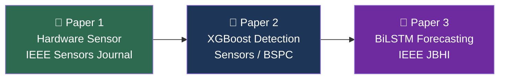
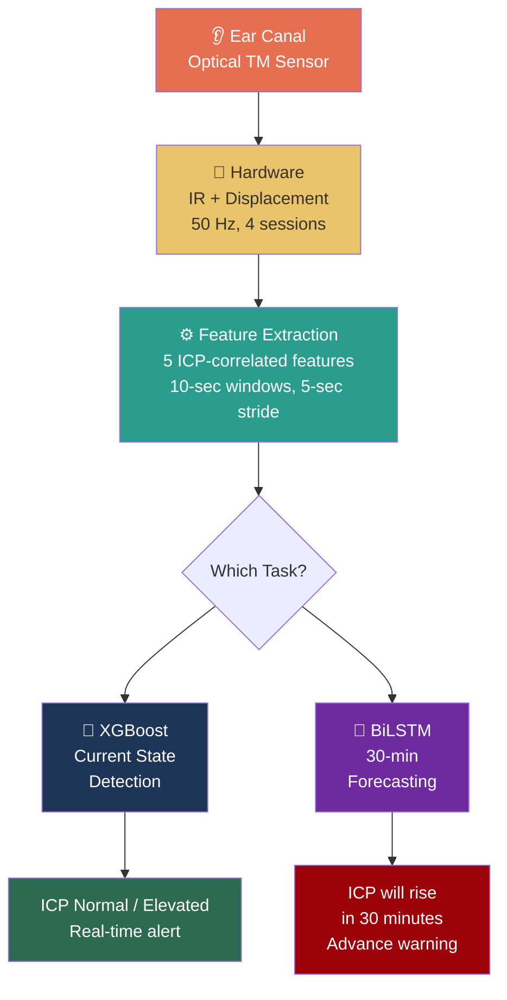
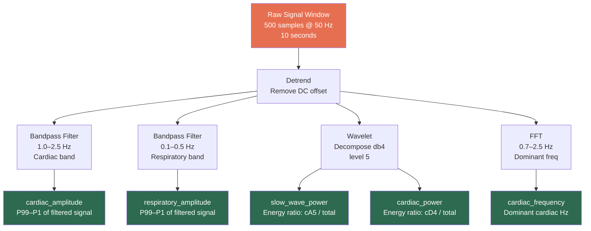
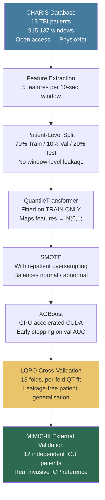
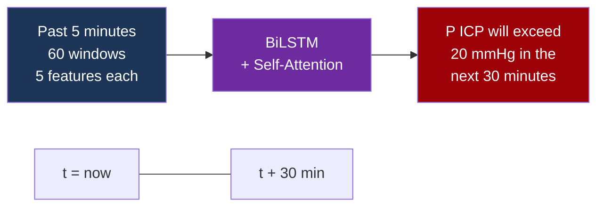
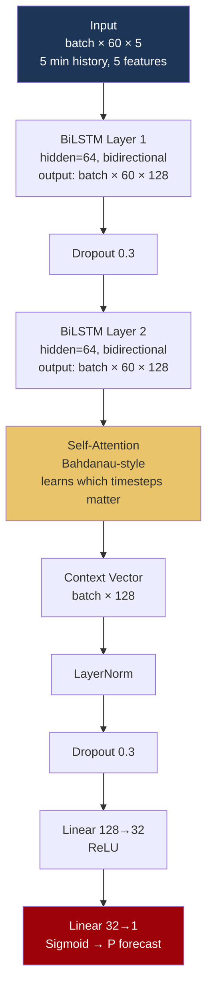
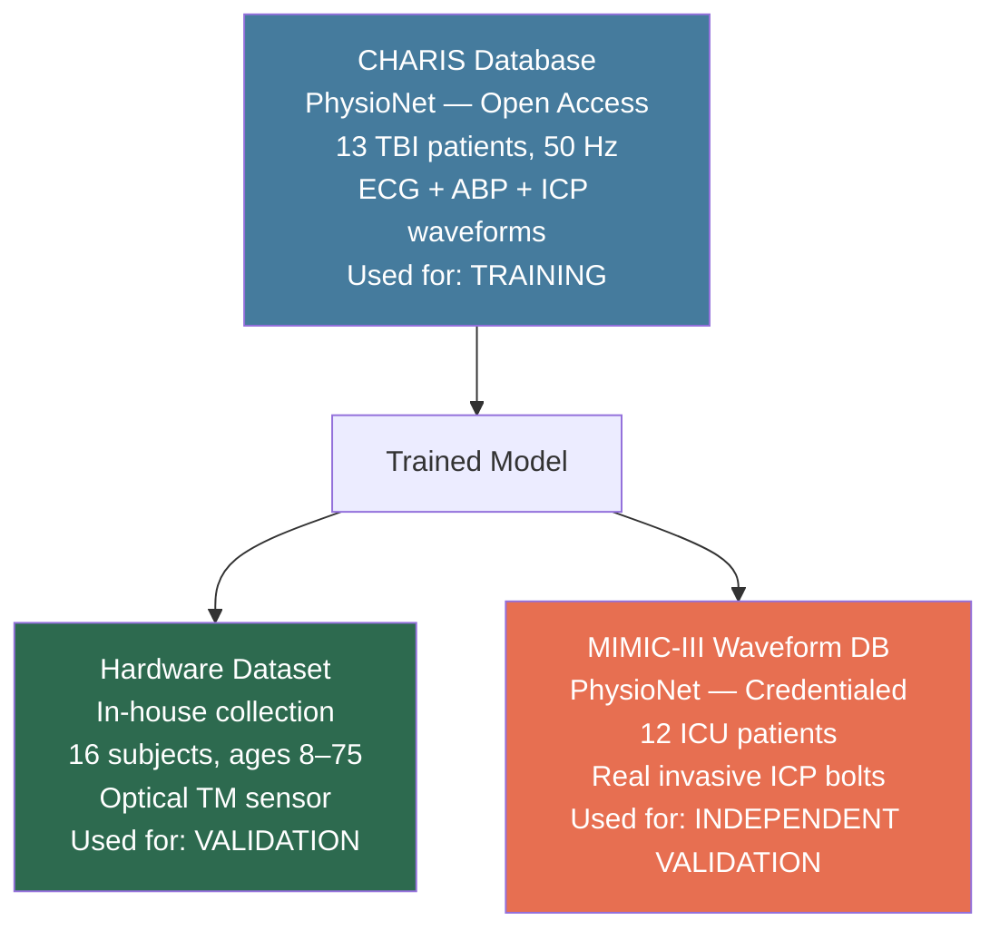

# Non-Invasive Intracranial Pressure Monitoring System

<div align="center">


**A non-invasive, optical tympanic membrane sensor system for real-time ICP anomaly detection and 30-minute advance elevation forecasting.**

*Capstone Research Project — Thapar Institute of Engineering and Technology*

</div>

---

## The Clinical Problem

> **Every year, over 69 million people sustain traumatic brain injury (TBI) worldwide.** Elevated intracranial pressure (ICP > 20 mmHg) is the leading cause of secondary brain injury and death. The current gold standard — drilling a hole in the skull and inserting a pressure bolt — is invasive, risky, and available only in ICU settings.

**We built a non-invasive alternative: an optical sensor placed in the ear canal.**

The system does two things no existing non-invasive approach does together:
1. **Real-time detection** — Is ICP elevated *right now*?
2. **30-minute forecasting** — Will ICP *become* critical in the next 30 minutes?

---

## The Science: How the Ear Reflects Brain Pressure

The tympanic membrane (TM) is hydraulically coupled to intracranial pressure through a well-established anatomical pathway:

```
ICP Change
    │
    ▼
CSF pressure change in cochlear aqueduct
    │
    ▼
Perilymph pressure change in scala tympani
    │
    ▼
Round window membrane displacement
    │
    ▼
Tympanic membrane micro-displacement  ← Our sensor detects this
```

> **Key insight:** When ICP rises, the TM stiffens and its acoustic/optical properties change. These changes are measurable — they carry the same frequency signatures (cardiac pulsations, respiratory modulation, slow waves) as the ICP waveform itself.

**Published basis:**
- Ragauskas et al. (2005) — TM displacement correlates with ICP
- Gwisdalla et al. (2012) — Ear canal pressure reflects ICP dynamics
- Aaslid et al. (1989) — Non-invasive cerebrovascular compliance measurement

---

## Three-Paper Research Strategy

This project is structured as three interconnected publications, each with a distinct contribution:



| | Paper 1 | Paper 2 | Paper 3 |
|---|---|---|---|
| **Contribution** | Novel TM optical sensor | Real-time ICP anomaly detection | 30-min advance ICP forecasting |
| **Model** | None (sensor validation) | XGBoost + QuantileTransformer | BiLSTM + Self-Attention |
| **Target** | IEEE Sensors Journal | Sensors (MDPI) / BSPC | IEEE JBHI / npj Digital Medicine |
| **Key Result** | Age gradient 0.6%→72.2% | LOPO AUC 0.9611 | 30-min advance warning |

---

## System Architecture



---

## Hardware Protocol

Each subject undergoes a standardised 4-session recording protocol:

```
┌─────────────────────────────────────────────────────────────────┐
│                    Recording Protocol                           │
├──────────────┬──────────┬───────────────────────────────────────┤
│ Session      │ Duration │ Purpose                               │
├──────────────┼──────────┼───────────────────────────────────────┤
│ 0  Supine    │  10 min  │ Baseline resting state                │
│ 1  Head +30° │   5 min  │ ICP reduction (postural)              │
│ 2  Head -10° │   5 min  │ ICP elevation (postural)              │
│ 3  Valsalva  │  ~7 min  │ Controlled transient ICP spike        │
├──────────────┴──────────┴───────────────────────────────────────┤
│ Total: ~27 minutes per subject  |  81,000 samples @ 50 Hz      │
└─────────────────────────────────────────────────────────────────┘
```

**16 subjects collected — ages 8 to 75:**

| Subject Group | N | Age Range | Profile |
|---|---|---|---|
| Children | 2 | 8–12 | Healthy |
| Teenagers | 2 | 16–21 | Healthy |
| Adults | 6 | 40–55 | Healthy |
| Elderly (healthy) | 3 | 65–75 | No comorbidities |
| Elderly (comorbid) | 2 | 72–75 | Hypertension / Diabetes |
| Pathological | 1 | 65–75 | Prior haemorrhage |

---

## Feature Extraction Pipeline

The same 5 features are extracted from every 10-second window (500 samples @ 50 Hz):



**Why these 5 features?**

| Feature | Physiology | ICP Link |
|---|---|---|
| `cardiac_amplitude` | Magnitude of cardiac ICP pulsations | Higher ICP → higher pulse pressure amplitude |
| `cardiac_frequency` | Heart rate extracted from ICP signal | Dysrhythmia correlates with intracranial hypertension |
| `respiratory_amplitude` | Breathing-induced ICP oscillations | Elevated ICP alters respiratory modulation |
| `slow_wave_power` | Lundberg slow waves (0–0.5 Hz) | Pathological slow waves appear with elevated ICP |
| `cardiac_power` | Fraction of signal energy in cardiac band | Shifts with cerebrovascular compliance changes |

---

## Paper 2: XGBoost Real-Time Detection

### Training Pipeline



### Results

```
┌─────────────────────────────────────────────────────────────────┐
│              XGBoost Classification Results                     │
├─────────────────────────────────────────────┬───────────────────┤
│ CHARIS Test AUC                             │      0.9792       │
│ CHARIS Train-Test Gap                       │      0.0106       │
│ LOPO AUC  (gold standard)                   │  0.9611 ± 0.058   │
│ LOPO 95% CI                                 │ [0.9242, 0.9852]  │
│ F1 Score                                    │      0.8040       │
│ Sensitivity (catches true abnormals)        │      87.6%        │
│ Specificity (clears true normals)           │      95.6%        │
├─────────────────────────────────────────────┴───────────────────┤
│              MIMIC-III Independent Validation                   │
│              (different hospital, real ICP bolts)               │
├─────────────────────────────────────────────┬───────────────────┤
│ Patients / Windows                          │   12 / 4,027      │
│ Pearson r  (P vs ICP mmHg)                  │     +0.7131       │
│ Spearman ρ (rank correlation)               │     +0.8060       │
│ Sensitivity                                 │      85.8%        │
│ Specificity                                 │      90.0%        │
│ Overall Accuracy                            │      89.8%        │
└─────────────────────────────────────────────┴───────────────────┘
```

### Validation Pyramid

```
                    ┌─────────────────────┐
                    │    MIMIC-III        │  ← Strongest: external, independent,
                    │  12 patients        │    real invasive ICP, different hospital
                    │  4,027 windows      │
                    │  89.8% accuracy     │
                  ┌─┴─────────────────────┴─┐
                  │     CHARIS LOPO CV      │  ← Gold standard: held-out patient
                  │     13 folds            │    never in training for that fold
                  │     AUC 0.9611          │
                ┌─┴─────────────────────────┴─┐
                │      CHARIS Test Split      │  ← Standard: 3 held-out patients
                │      3 patients             │
                │      AUC 0.9792             │
                └─────────────────────────────┘
```

### Hardware Age Gradient (Physiological Validation)

```
Age  8F  ████░░░░░░░░░░░░░░░░░░░░░░░░░░  0.6%   Normal child
Age 12M  ████████░░░░░░░░░░░░░░░░░░░░░░  2.2%   Normal child
Age 16M  █████████████░░░░░░░░░░░░░░░░░  4.4%   Normal teen
Age 19F  █████████████████████░░░░░░░░░  6.6%   Healthy young adult
Age 40F  ████████████░░░░░░░░░░░░░░░░░░  3.8%   Healthy adult
Age 40M  ████████████████████░░░░░░░░░░  7.5%   Healthy adult
Age 47F  ████████████████████░░░░░░░░░░  8.2%   Healthy adult
Age 50M  ████████████████████████░░░░░░ 12.6%   Mild elevation (age-related)
Age 55M  ████████████████████░░░░░░░░░░  8.5%   Healthy adult
Age 65+  ████████████████████████████░░ 27.0%   Elderly (normal)
Age 75F  ██████████████████████████████ 40.9%   Elderly (no comorbidity)
Age 72F  ████████████████████████████████ 46.2% Elderly + HTN/DM
Age 65+H ██████████████████████████████████ 65.6% Elderly + haemorrhage
Age 75M  ████████████████████████████████████ 72.2% Elderly + HTN/DM (highest)
```

> **Key finding:** Same age (75), different pathology → 31.3% gap. Model detects **cerebrovascular compliance**, not just age.

---

## Paper 3: BiLSTM 30-Minute ICP Forecasting

### The Forecasting Task



**Why this matters clinically:** Current ICP monitors alarm only when ICP is *already* elevated — by then, irreversible damage may have begun. A 30-minute advance warning gives clinicians time to:
- Adjust head position
- Administer osmotic therapy (mannitol)
- Prepare for emergency intervention

### Label Generation

For each window `i` in patient `p`:

```
y_forecast[i] = 1  if  ANY window in [i+1 ... i+360] is abnormal
              = 0  otherwise
              = -1 (excluded) for the last 360 windows of each patient
```

> 360 windows × 5-second stride = **30 minutes of look-ahead**. This is computed per-patient with no cross-patient leakage.

### Architecture



**Why BiLSTM + Attention over simple LSTM?**
- **Bidirectional:** Captures both rising and falling trends within the 5-min window
- **Self-Attention:** Learns to weight critical moments (e.g., a spike 2 min ago matters more than baseline)
- **Forecasting ≠ Classification:** The model sees past patterns, not just the current state

### Training Configuration

```
Horizon  : 360 windows = 30 minutes
History  : 60 windows  = 5 minutes
Sequences: 132,930 training sequences
Batch    : 512
Epochs   : 50 with cosine annealing LR
Optimizer: Adam, lr=1e-3, weight_decay=1e-4
Loss     : BCEWithLogitsLoss with pos_weight (class-balanced)
```

---

## Data Sources



| Dataset | Source | N Patients | Signal | Role |
|---|---|---|---|---|
| CHARIS | PhysioNet (open) | 13 | ICP + ABP + ECG | Training |
| Hardware | In-house | 16 | TM optical sensor | Hardware validation |
| MIMIC-III | PhysioNet (credentialed) | 12 | Invasive ICP + ABP | Independent validation |

---

## Key Results Summary

| Metric | Value | Significance |
|---|---|---|
| LOPO AUC | **0.9611 ± 0.058** | Patient-level generalisation proven |
| MIMIC Accuracy | **89.8%** | Independent hospital, real ICP bolts |
| MIMIC Spearman ρ | **+0.806** | Model output tracks continuous ICP mmHg |
| Extreme windows | **20 / 20 correct** | ICP=0→P≈0, ICP=46→P≈1 |
| Hardware gradient | **0.6% → 72.2%** | Physiologically ordered across all 16 subjects |
| Comorbidity gap | **+31.3%** | Same age, different pathology — model detects it |

---

## Repo Structure

```
Pran/
│
├── full_pipeline_qt.py      # Paper 2: XGBoost detection (main pipeline)
├── bilstm_forecast.py       # Paper 3: BiLSTM 30-min forecasting
├── mimic_validate.py        # MIMIC-III independent validation
├── regen_cache.py           # Regenerate CHARIS feature cache
├── show_results.py          # Visualisation and results display
│
├── hw-tests/                # Hardware CSV recordings (16 subjects)
│   ├── icp_1_27min.csv
│   ├── icp_2.csv
│   └── icp_{N}_{age}_{sex}.csv   # Auto-detected by pipeline
│
├── data/
│   └── raw/charis/          # CHARIS WFDB files (charis1–charis13)
│
├── models/
│   ├── xgb_qt.json          # Trained XGBoost model
│   ├── qt_scaler.pkl        # QuantileTransformer (XGBoost)
│   └── bilstm_forecaster.pt # Trained BiLSTM forecaster (after training)
│
└── results/
    ├── audit/cache/         # Precomputed CHARIS features (X, y, pid)
    ├── qt_pipeline/         # XGBoost results and plots
    ├── bilstm_forecast/     # BiLSTM forecasting results
    └── mimic_validation/    # MIMIC-III validation results
```

---

## Quickstart

```bash
# 1. Clone and install
git clone https://github.com/your-repo/Pran.git
cd Pran
pip install xgboost scikit-learn imbalanced-learn torch pywt wfdb scipy matplotlib seaborn pandas numpy

# 2. Regenerate CHARIS feature cache (if needed)
python regen_cache.py

# 3. Run XGBoost pipeline (Paper 2)
python full_pipeline_qt.py

# 4. Run MIMIC-III validation
python mimic_validate.py

# 5. Run BiLSTM forecasting pipeline (Paper 3)
python -u bilstm_forecast.py

# 6. Add hardware subjects: drop any icp_{N}_{age}_{sex}.csv into hw-tests/
#    The pipeline auto-detects all CSVs — no code changes needed
```

---

## Methodology Highlights

### Why LOPO CV and Not Simple Train-Test Split?

In medical ML, patient-level leakage is the most common source of inflated results. If windows from the same patient appear in both train and test, the model memorises patient-specific features rather than learning generalisable ICP dynamics.

**Leave-One-Patient-Out CV** forces the model to predict on a patient it has *never seen in any form*:

```
Fold 1: Train [P2-P13] → Test [P1]     AUC: 0.9586
Fold 2: Train [P1,P3-P13] → Test [P2]  AUC: 0.9707
...
Fold 13: Train [P1-P12] → Test [P13]   AUC: 0.9509
─────────────────────────────────────────────────────
Mean LOPO AUC: 0.9611 ± 0.058
```

Each fold also fits its own QuantileTransformer — no distribution information leaks from future patients into past folds.

### Why QuantileTransformer (Not Z-score)?

ICP features are highly skewed (most windows have low cardiac amplitude; pathological spikes create extreme outliers). Z-score normalisation is sensitive to these outliers. QT maps each feature to a standard normal distribution, making XGBoost more robust to the distribution shift between CHARIS (ICP waveform) and hardware (optical TM sensor).

---

## Limitations & Future Work

| Limitation | Impact | Path Forward |
|---|---|---|
| No simultaneous ear sensor + ICP bolt | Hardware-to-model domain gap unquantified | Clinical collaboration (PGI Chandigarh) |
| 16 hardware subjects | Pilot-scale hardware validation | Collect 100 subjects (ongoing) |
| CHARIS features from ICP waveform | Model trained on invasive signal | Hybrid training with hardware normals |
| BiLSTM tested on CPU only | Long training time | GPU cluster / Google Colab |

---
</div>
