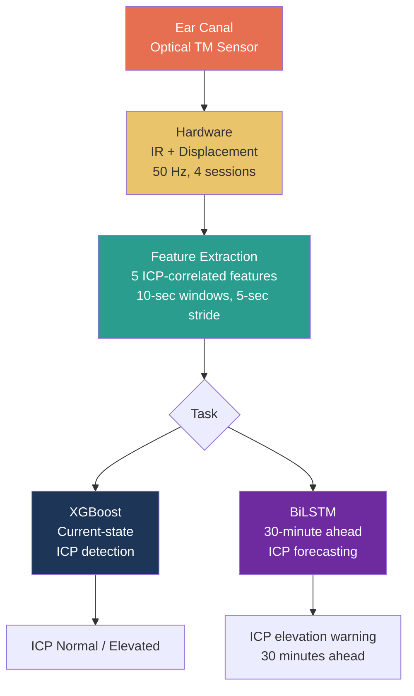
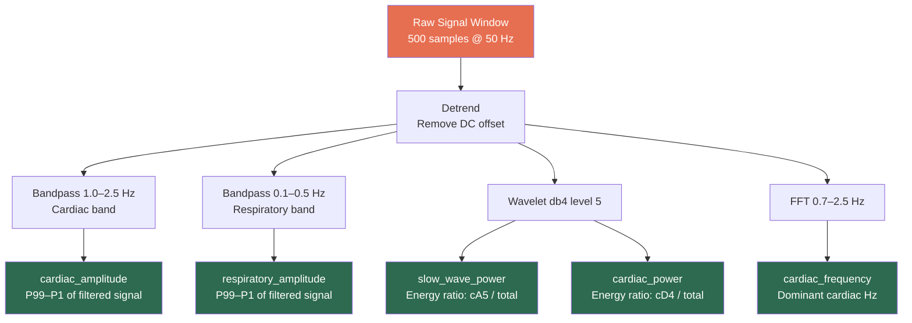
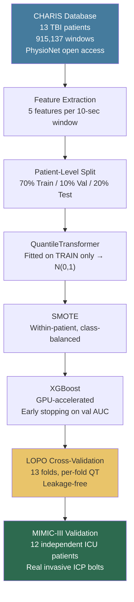
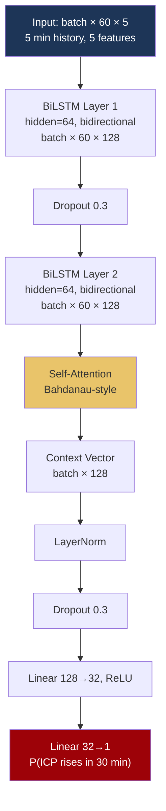

# Non-Invasive Intracranial Pressure Monitoring

<div align="center">


**Non-invasive ICP anomaly detection via optical tympanic membrane sensor and machine learning.**

</div>

---

## The Clinical Problem

> **Over 69 million people sustain traumatic brain injury annually.** Elevated intracranial pressure (ICP > 20 mmHg) is the leading cause of secondary brain injury and death. The current gold standard requires drilling a hole in the skull and inserting a pressure bolt — invasive, risky, and available only in ICU settings.

This system provides a non-invasive alternative using an optical sensor placed in the ear canal, extracting ICP-correlated features from the tympanic membrane signal.

---

## The Science: How the Ear Reflects Brain Pressure

The tympanic membrane (TM) is hydraulically coupled to intracranial pressure through an established anatomical pathway:

```
ICP Change
    │
    ▼
CSF pressure change in cochlear aqueduct
    │
    ▼
Perilymph pressure change in scala tympani
    │
    ▼
Round window membrane displacement
    │
    ▼
Tympanic membrane micro-displacement  ← optical sensor detects this
```

When ICP rises, the TM stiffens and its optical properties change. These changes carry the same frequency signatures as the ICP waveform — cardiac pulsations, respiratory modulation, and slow waves.

**Supporting literature:**
- Ragauskas et al. (2005) — TM displacement correlates with ICP
- Gwisdalla et al. (2012) — Ear canal pressure reflects ICP dynamics
- Aaslid et al. (1989) — Non-invasive cerebrovascular compliance measurement

---

## System Architecture



---

## Hardware Protocol

Each subject undergoes a standardised 4-session recording:

```
┌──────────────────────────────────────────────────────────────┐
│                     Recording Protocol                       │
├──────────────┬──────────┬──────────────────────────────────  │
│ Session      │ Duration │ Purpose                            │
├──────────────┼──────────┼──────────────────────────────────  │
│ 0  Supine    │  10 min  │ Baseline resting state             │
│ 1  Head +30° │   5 min  │ ICP reduction (postural)           │
│ 2  Head -10° │   5 min  │ ICP elevation (postural)           │
│ 3  Valsalva  │  ~7 min  │ Controlled transient ICP spike     │
├──────────────┴──────────┴──────────────────────────────────  │
│ Total: ~27 minutes per subject  |  ~81,000 samples @ 50 Hz  │
└──────────────────────────────────────────────────────────────┘
```

**19 subjects — ages 8 to 75:**

| Group | N | Age Range | Profile |
|---|---|---|---|
| Children | 2 | 8–12 | Healthy |
| Teenagers | 3 | 16–21 | Healthy |
| Adults | 7 | 40–55 | Healthy |
| Elderly (healthy) | 3 | 65–75 | No comorbidities |
| Elderly (comorbid) | 2 | 72–75 | Hypertension / Diabetes |
| Pathological | 1 | 65–75 | Prior haemorrhage |
| Unknown | 1 | ? | Unknown profile |

---

## Feature Extraction Pipeline

Five features extracted from every 10-second window (500 samples @ 50 Hz):



| Feature | Physiology | ICP Link |
|---|---|---|
| `cardiac_amplitude` | Cardiac ICP pulsation magnitude | Higher ICP → higher pulse pressure amplitude |
| `cardiac_frequency` | Heart rate from ICP signal | Dysrhythmia correlates with intracranial hypertension |
| `respiratory_amplitude` | Breathing-induced ICP oscillations | Elevated ICP alters respiratory modulation |
| `slow_wave_power` | Lundberg slow waves (0–0.5 Hz) | Pathological slow waves emerge with elevated ICP |
| `cardiac_power` | Cardiac band energy fraction | Shifts with cerebrovascular compliance changes |

**Feature ablation results** (LOPO AUC when each feature is removed):

| Feature | AUC without | ΔAUC |
|---|---|---|
| `cardiac_amplitude` | 0.7534 | **−0.208** — dominant feature |
| `slow_wave_power` | 0.9380 | −0.023 |
| `cardiac_frequency` | 0.9391 | −0.022 |
| `cardiac_power` | 0.9538 | −0.007 |
| `respiratory_amplitude` | 0.9622 | +0.001 |

---

## XGBoost Detection Pipeline

### Training Architecture



### Why LOPO CV

In medical ML, windows from the same patient are temporally correlated. A simple train-test split leaks patient-specific features. Leave-One-Patient-Out forces the model to predict on a patient it has never seen in any form:

```
Fold 1:  Train [P2–P13]      → Test [P1]   AUC: 0.9586
Fold 2:  Train [P1,P3–P13]   → Test [P2]   AUC: 0.9707
Fold 4:  Train [P1-P3,P5–P13]→ Test [P4]   AUC: 0.7759  ← hardest patient
...
Fold 13: Train [P1–P12]      → Test [P13]  AUC: 0.9509
─────────────────────────────────────────────────────────
Mean LOPO AUC: 0.9611 ± 0.058   95% CI [0.9242, 0.9852]
```

Each fold fits its own QuantileTransformer — no distribution information leaks from future patients.

### Why QuantileTransformer

ICP features are highly skewed — most windows have low cardiac amplitude, with pathological spikes creating extreme outliers. Z-score normalisation is sensitive to these outliers. QT maps each feature to a standard normal distribution, making the model robust to the distribution shift between CHARIS (invasive ICP waveform) and hardware (optical TM signal).

---

## Results

### CHARIS Performance

```
Test AUC          : 0.9792   (train-test gap: +0.0106)
F1 Score          : 0.8040
Sensitivity       : 87.6%
Specificity       : 95.6%
Balanced Accuracy : 91.6%
LOPO AUC          : 0.9611 ± 0.058   95% CI [0.9242, 0.9852]
LOPO F1           : 0.7642 ± 0.142
```

### Baseline Comparison (LOPO AUC)

| Model | AUC | ± | F1 | ± |
|---|---|---|---|---|
| Logistic Regression | 0.8936 | 0.1553 | 0.6108 | 0.2378 |
| Random Forest | 0.9383 | 0.0978 | 0.7541 | 0.1593 |
| Linear SVM | 0.8926 | 0.1570 | 0.6107 | 0.2390 |
| **XGBoost** | **0.9611** | **0.0583** | **0.7642** | **0.1422** |

XGBoost achieves the highest mean AUC and the lowest variance — meaning it is both more accurate and more consistent across unseen patients.

**Statistical significance:**

| Comparison | DeLong z | p | Wilcoxon p |
|---|---|---|---|
| XGBoost vs Logistic Regression | +42.70 | <0.001 *** | 0.0006 *** |
| XGBoost vs Random Forest | +23.53 | <0.001 *** | 0.0006 *** |
| XGBoost vs Linear SVM | +42.46 | <0.001 *** | 0.0012 ** |

### MIMIC-III Independent Validation

12 patients from a separate hospital with real invasive ICP bolts — never used in training:

```
Patients / Windows    : 12 / 4,078
AUC                   : 0.9258
Accuracy              : 88.6%   (threshold=0.2953)
F1                    : 0.6542
Pearson r             : +0.7131  (p≈0)
Spearman ρ            : +0.8060  (p≈0)
Mean P | ICP < 20 mmHg : 0.093
Mean P | ICP ≥ 20 mmHg : 0.699
Separation             : +0.605  (correct direction)
```

### Validation Hierarchy

```
                ┌──────────────────────────┐
                │      MIMIC-III           │  External, independent hospital
                │  AUC 0.9258              │  Real invasive ICP, 12 patients
              ┌─┴──────────────────────────┴─┐
              │       CHARIS LOPO CV         │  Gold standard CV
              │  AUC 0.9611 ± 0.058          │  13 held-out patient folds
            ┌─┴──────────────────────────────┴─┐
            │       CHARIS Test Split          │  Standard held-out test
            │  AUC 0.9792                      │  3 patients
            └──────────────────────────────────┘
```

### Hardware Validation — Age & Comorbidity Gradient

```
Age  8F  ██░░░░░░░░░░░░░░░░░░  0.6%   Healthy child
Age 12M  ███░░░░░░░░░░░░░░░░░  2.2%   Healthy child
Age 16M  ████░░░░░░░░░░░░░░░░  4.4%   Healthy teen
Age 17F  ████░░░░░░░░░░░░░░░░  2.8%   Healthy teen
Age 19M  ████░░░░░░░░░░░░░░░░  2.8%   Healthy adult
Age 19-21  █████░░░░░░░░░░░░░  6.6-7.8% Healthy young adults
Age 40F  ████░░░░░░░░░░░░░░░░  3.8%   Healthy adult
Age 40M  ██████░░░░░░░░░░░░░░  7.5%   Healthy adult
Age 47F  ██████░░░░░░░░░░░░░░  8.2%   Healthy adult
Age 50F  █████░░░░░░░░░░░░░░░  5.7%   Healthy adult
Age 50M  █████████░░░░░░░░░░░ 12.6%   Mild elevation
Age 55M  ██████░░░░░░░░░░░░░░  8.5%   Healthy adult
Age 65-75  ████████████████░░ 27.0%   Elderly
Age 75F  █████████████████░░░ 40.9%   Elderly
Age 72F  ██████████████████░░ 46.2%   Elderly + HTN/DM
Age 65-75H ████████████████████ 65.6% Elderly + haemorrhage
Age 75M  ████████████████████ 72.2%   Elderly + HTN/DM (highest)
```

> Same age (75), different pathology → 31.3% gap. The model detects cerebrovascular compliance, not just age.

### Valsalva Maneuver Validation

The valsalva session produces a controlled, transient ICP elevation. Across all 19 subjects:

```
Mean valsalva flag%   : 31.3%
Mean baseline flag%   : 13.2%
Mean elevation        : +18.1%
Subjects elevated     : 19 / 19
Wilcoxon one-tailed   : p = 0.0001  ***
```

Every single subject shows higher flagging during valsalva than at baseline — statistically significant across the full cohort.

---

## BiLSTM 30-Minute Forecasting

### The Task

Given 5 minutes of past ICP-correlated features, predict whether ICP will exceed 20 mmHg within the next 30 minutes.

```
y_forecast[i] = 1  if ANY window in [i+1 ... i+360] is abnormal
              = 0  otherwise
              = excluded for the last 360 windows of each patient
```

360 windows × 5-second stride = 30 minutes of look-ahead, computed per-patient with no cross-patient leakage.

### Architecture



**Why BiLSTM + Attention:**
- **Bidirectional:** captures both rising and falling trends within the history window
- **Self-Attention:** learns to weight critical moments over baseline noise
- **Forecasting ≠ Classification:** the model sees temporal patterns, not just current state
- **pos_weight loss:** handles class imbalance without SMOTE (SMOTE breaks temporal ordering in sequences)

---

## Data Sources

| Dataset | Source | Patients | Signal | Role |
|---|---|---|---|---|
| CHARIS | PhysioNet (open access) | 13 TBI | ICP + ABP + ECG | Training |
| Hardware | In-house | 19 | Optical TM sensor | Hardware validation |
| MIMIC-III | PhysioNet (credentialed) | 12 ICU | Invasive ICP + ABP | Independent validation |

---

## Repo Structure

```
Pran/
├── full_pipeline_qt.py      # XGBoost detection pipeline
├── bilstm_forecast.py       # BiLSTM 30-min forecasting
├── mimic_validate.py        # MIMIC-III independent validation
├── regen_cache.py           # CHARIS feature cache generation
│
├── hw-tests/                # Hardware CSV recordings (19 subjects)
│   └── icp_{N}_{age}_{sex}.csv
│
├── models/
│   ├── xgb_qt.json          # Trained XGBoost model
│   ├── qt_scaler.pkl        # QuantileTransformer
│   ├── xgb_qt_thr.pkl       # Youden threshold + convergence curves
│   ├── xgb_lopo/            # XGBoost LOPO fold models (13 × .json)
│   ├── baselines/           # Baseline LOPO fold models (39 × .pkl)
│   └── ablation/            # Feature ablation fold models (5 × 13)
│
└── results/
    ├── audit/cache/         # Precomputed CHARIS features (X, y, pid)
    └── qt_pipeline/         # XGBoost results, plots, JSON
        ├── qt_results.json
        ├── qt_pipeline_results.png
        ├── fig_model_comparison.png
        └── fig_calibration.png
```

---

## Quickstart

```bash
# Install dependencies
pip install xgboost scikit-learn imbalanced-learn torch pywt wfdb scipy matplotlib seaborn pandas numpy

# Regenerate CHARIS feature cache
python regen_cache.py

# Run XGBoost pipeline (trains once, cached on subsequent runs)
python full_pipeline_qt.py

# Run MIMIC-III independent validation
python mimic_validate.py

# Add hardware subjects: drop icp_{N}_{age}_{sex}.csv into hw-tests/
# Pipeline auto-detects all CSVs — no code changes needed
```
