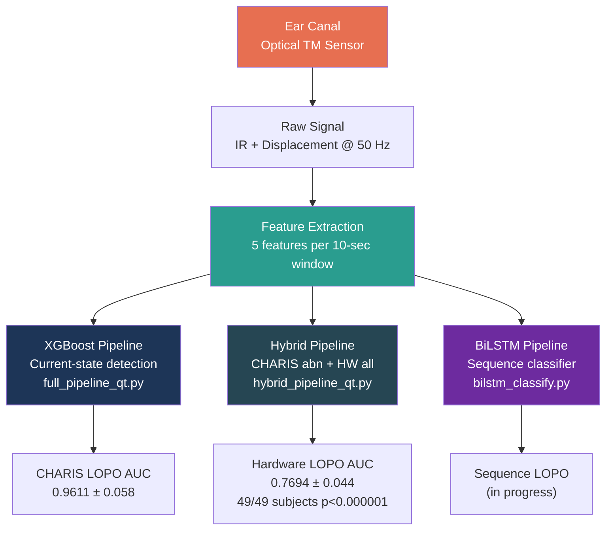
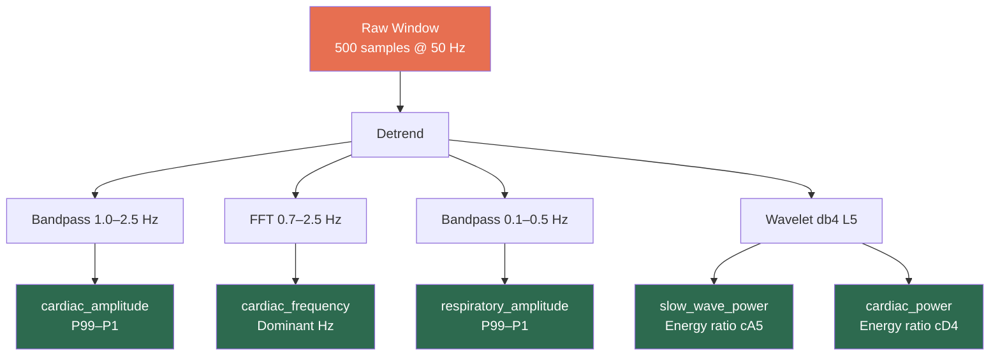
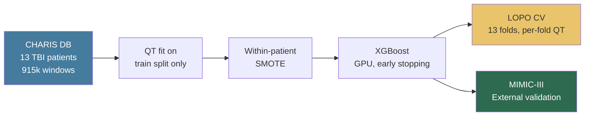
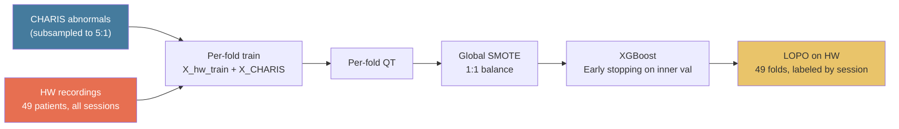
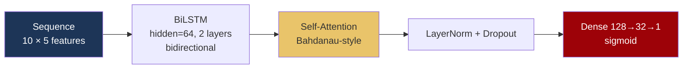

# Non-Invasive Intracranial Pressure Monitoring

<div align="center">


**Non-invasive ICP anomaly detection via optical tympanic membrane sensor and machine learning.**

</div>

---

## The Clinical Problem

> **Over 69 million people sustain traumatic brain injury annually.** Elevated intracranial pressure (ICP > 20 mmHg) is the leading cause of secondary brain injury and death. The gold standard requires drilling a hole in the skull and inserting a pressure bolt — invasive, risky, and available only in ICU settings.

This system provides a non-invasive alternative using an optical sensor placed in the ear canal to detect ICP-correlated features from the tympanic membrane (TM) signal.

---

## The Science: How the Ear Reflects Brain Pressure

The tympanic membrane is hydraulically coupled to intracranial pressure through an established anatomical pathway:

```
ICP Change
    │
    ▼
CSF pressure change in cochlear aqueduct
    │
    ▼
Perilymph pressure change in scala tympani
    │
    ▼
Round window membrane displacement
    │
    ▼
Tympanic membrane micro-displacement  ← optical sensor detects this
```

When ICP rises, the TM stiffens and its optical properties change. These changes carry the same frequency signatures as the ICP waveform — cardiac pulsations, respiratory modulation, and slow waves.

**Supporting literature:** Ragauskas et al. (2005), Gwisdalla et al. (2012), Aaslid et al. (1989)

---

## System Architecture


```mermaid
graph TD
    A["Ear Canal\nOptical TM Sensor"] --> B["Raw Signal\nIR + Displacement @ 50 Hz"]
    B --> FE["Feature Extraction\n5 features per 10-sec window"]
    FE --> XGB["XGBoost Pipeline\nCurrent-state detection\nfull_pipeline_qt.py"]
    FE --> HYB["Hybrid Pipeline\nCHARIS abn + HW all\nhybrid_pipeline_qt.py"]
    FE --> BIL["BiLSTM Pipeline\nSequence classifier\nbilstm_classify.py"]
    XGB --> R1["CHARIS LOPO AUC\n0.9611 ± 0.058"]
    HYB --> R2["Hardware LOPO AUC\n0.7694 ± 0.044\n49/49 subjects p<0.000001"]
    BIL --> R3["Sequence LOPO\n(in progress)"]

    style A fill:#e76f51,color:#fff
    style FE fill:#2a9d8f,color:#fff
    style XGB fill:#1d3557,color:#fff
    style HYB fill:#264653,color:#fff
    style BIL fill:#6d2b9f,color:#fff
```

---

## Hardware Protocol

Each subject undergoes a standardised 4-session recording:

```
┌──────────────────────────────────────────────────────────────┐
│                     Recording Protocol                        │
├──────────────┬──────────┬─────────────────────────────────── │
│ Session      │ Duration │ Purpose                             │
├──────────────┼──────────┼─────────────────────────────────── │
│ 0  Supine    │  10 min  │ Baseline resting state              │
│ 1  Head +30° │   5 min  │ ICP reduction (postural)            │
│ 2  Head -10° │   5 min  │ ICP elevation (postural)            │
│ 3  Valsalva  │  ~7 min  │ Controlled transient ICP spike      │
├──────────────┴──────────┴─────────────────────────────────── │
│ Total: ~27 min per subject  |  ~80,000 samples @ 50 Hz       │
└──────────────────────────────────────────────────────────────┘
```

**49 subjects — ages 8 to 83:**

| Group | N | Age Range | Profile |
|---|---|---|---|
| Children | 3 | 8–13 | Healthy |
| Teenagers | 6 | 16–19 | Healthy |
| Young adults | 18 | 19–22 | Healthy |
| Adults | 12 | 26–55 | Healthy / mixed |
| Elderly | 6 | 65–79 | Healthy / comorbid |
| Pathological | 1 | 83 | Prior haemorrhage |
| Unknown | 3 | ? | Various profiles |

Session 3 (valsalva) serves as a controlled ground-truth ICP elevation stimulus — the subject performs a Valsalva manoeuvre (forced expiration against a closed glottis), transiently raising ICP by 5–15 mmHg.

---

## Feature Extraction

Five features extracted from every 10-second window (500 samples @ 50 Hz, 5-second stride):


```mermaid
graph TD
    Raw["Raw Window\n500 samples @ 50 Hz"] --> Dt["Detrend"]
    Dt --> BPC["Bandpass 1.0–2.5 Hz"] --> F1["cardiac_amplitude\nP99–P1"]
    Dt --> FFT["FFT 0.7–2.5 Hz"]     --> F2["cardiac_frequency\nDominant Hz"]
    Dt --> BPR["Bandpass 0.1–0.5 Hz"] --> F3["respiratory_amplitude\nP99–P1"]
    Dt --> WV["Wavelet db4 L5"]        --> F4["slow_wave_power\nEnergy ratio cA5"]
    WV                                 --> F5["cardiac_power\nEnergy ratio cD4"]

    style Raw fill:#e76f51,color:#fff
    style F1 fill:#2d6a4f,color:#fff
    style F2 fill:#2d6a4f,color:#fff
    style F3 fill:#2d6a4f,color:#fff
    style F4 fill:#2d6a4f,color:#fff
    style F5 fill:#2d6a4f,color:#fff
```

| Feature | Physiology | ICP Link |
|---|---|---|
| `cardiac_amplitude` | Cardiac ICP pulsation magnitude | Higher ICP → higher pulse pressure |
| `cardiac_frequency` | Heart rate from ICP waveform | Dysrhythmia with intracranial hypertension |
| `respiratory_amplitude` | Breathing-induced ICP oscillations | Elevated ICP alters respiratory modulation |
| `slow_wave_power` | Lundberg slow waves (0–0.5 Hz) | Pathological slow waves emerge at elevated ICP |
| `cardiac_power` | Cardiac band energy fraction | Shifts with cerebrovascular compliance changes |

---

## Pipelines

### Pipeline 1 — CHARIS XGBoost (`full_pipeline_qt.py`)

Train on CHARIS invasive ICP data, evaluate with LOPO CV, validate on MIMIC-III.


```mermaid
graph LR
    C["CHARIS DB\n13 TBI patients\n915k windows"] --> QT["QT fit on\ntrain split only"]
    QT --> SMOTE["Within-patient\nSMOTE"]
    SMOTE --> XGB["XGBoost\nGPU, early stopping"]
    XGB --> LOPO["LOPO CV\n13 folds, per-fold QT"]
    XGB --> MIMIC["MIMIC-III\nExternal validation"]

    style C fill:#457b9d,color:#fff
    style LOPO fill:#e9c46a,color:#333
    style MIMIC fill:#2d6a4f,color:#fff
```

**Why LOPO:** Windows from the same patient are temporally correlated. LOPO forces the model to predict on patients it has never seen in any form — the gold standard for medical ML.

**Why QuantileTransformer:** ICP features are highly skewed. QT maps each feature to a normal distribution, making the model robust to the distribution shift between CHARIS (invasive waveform) and hardware (optical TM).

---

### Pipeline 2 — Hybrid XGBoost (`hybrid_pipeline_qt.py`)

Train on CHARIS abnormals + hardware normals + hardware valsalva. LOPO on hardware patients — real labeled AUC, not inference-only.


```mermaid
graph LR
    C["CHARIS abnormals\n(subsampled to 5:1)"] --> TR["Per-fold train\nX_hw_train + X_CHARIS"]
    H["HW recordings\n49 patients, all sessions"] --> TR
    TR --> QT2["Per-fold QT"]
    QT2 --> SMOTE2["Global SMOTE\n1:1 balance"]
    SMOTE2 --> XGB2["XGBoost\nEarly stopping on inner val"]
    XGB2 --> LOPO2["LOPO on HW\n49 folds, labeled by session"]

    style C fill:#457b9d,color:#fff
    style H fill:#e76f51,color:#fff
    style LOPO2 fill:#e9c46a,color:#333
```

**Ground truth:** Session 3 (valsalva) = elevated ICP = y=1. Sessions 0–2 = normal = y=0.  
**Threshold:** Youden's J on inner 90/10 val split of SMOTE train — never touches test fold.  
**Valsalva stats:** From LOPO predictions (each patient was held-out during its fold — unbiased).

---

### Pipeline 3 — BiLSTM Classifier (`bilstm_classify.py`)

Same hybrid training strategy as Pipeline 2, but uses sequences of 10 consecutive windows (50 seconds of context) as input. Captures temporal buildup of ICP signals.


```mermaid
graph LR
    In["Sequence\n10 × 5 features"] --> BLSTM["BiLSTM\nhidden=64, 2 layers\nbidirectional"]
    BLSTM --> ATTN["Self-Attention\nBahdanau-style"]
    ATTN --> LN["LayerNorm + Dropout"]
    LN --> HEAD["Dense 128→32→1\nsigmoid"]

    style In fill:#1d3557,color:#fff
    style ATTN fill:#e9c46a,color:#333
    style HEAD fill:#9d0208,color:#fff
```

Sequences are built **within each session only** (no cross-session contamination). Labels from session: valsalva = 1, others = 0.

---

## Results

### CHARIS Validation

```
Test AUC          : 0.9792   (train-test gap: +0.0106)
F1 Score          : 0.8040
Sensitivity       : 87.6%
Specificity       : 95.6%
Balanced Accuracy : 91.6%
Calibration       : Brier=0.0431, ECE=0.0312
```

### CHARIS LOPO Cross-Validation

```
LOPO AUC   : 0.9611 ± 0.058   95% CI [0.9242, 0.9852]
LOPO F1    : 0.7642 ± 0.142
Folds      : 13 patients, per-fold QT (leak-free)
```

Per-fold example:
```
Patient P1 : AUC 0.9586
Patient P2 : AUC 0.9707
Patient P4 : AUC 0.7759  ← prior haemorrhage — altered coupling
...
Patient P13: AUC 0.9509
```

### Baseline Comparison (CHARIS LOPO)

| Model | AUC | ± std | F1 |
|---|---|---|---|
| Logistic Regression | 0.8936 | 0.1553 | 0.6108 |
| Random Forest | 0.9383 | 0.0978 | 0.7541 |
| Linear SVM | 0.8926 | 0.1570 | 0.6107 |
| **XGBoost** | **0.9611** | **0.0583** | **0.7642** |

**Statistical tests (XGBoost vs each baseline):**

| Comparison | DeLong z | p | Wilcoxon p |
|---|---|---|---|
| vs Logistic Regression | +42.70 | <0.001 *** | 0.0006 *** |
| vs Random Forest | +23.53 | <0.001 *** | 0.0006 *** |
| vs Linear SVM | +42.46 | <0.001 *** | 0.0012 ** |

### Feature Ablation (CHARIS LOPO, drop-one)

| Feature | AUC without | ΔAUC |
|---|---|---|
| `cardiac_amplitude` | 0.7534 | **−0.208** — dominant |
| `slow_wave_power` | 0.9380 | −0.023 |
| `cardiac_frequency` | 0.9391 | −0.022 |
| `cardiac_power` | 0.9538 | −0.007 |
| `respiratory_amplitude` | 0.9622 | +0.001 |

### MIMIC-III Independent Validation

12 patients from a separate hospital with real invasive ICP bolts — never used in training:

```
Patients / Windows      : 12 / 4,078
AUC                     : 0.9258
Accuracy                : 88.6%
F1                      : 0.6542
Pearson r               : +0.7131  (p ≈ 0)
Spearman ρ              : +0.8060  (p ≈ 0)
Mean P | ICP < 20 mmHg  : 0.093
Mean P | ICP ≥ 20 mmHg  : 0.699
```

### Validation Hierarchy

```
                ┌──────────────────────────────────┐
                │         MIMIC-III                 │  External hospital, 12 patients
                │  AUC 0.9258                       │  Real invasive ICP bolts
              ┌─┴──────────────────────────────────┴─┐
              │         CHARIS LOPO CV               │  Gold standard CV
              │  AUC 0.9611 ± 0.058                  │  13 held-out patient folds
            ┌─┴──────────────────────────────────────┴─┐
            │         CHARIS Test Split                 │  Held-out test set
            │  AUC 0.9792                               │  3 patients
            └────────────────────────────────────────────┘
```

---

### Hybrid Pipeline — Hardware LOPO (49 subjects)

Hardware LOPO is a harder, more realistic evaluation than CHARIS LOPO:
- Test subjects are **healthy volunteers** — no strong ICP pathology
- Ground truth is **valsalva-induced** ICP elevation, not invasive monitoring
- Transient ICP rise (~5–15 mmHg) is far subtler than ICU hypertension (>20 mmHg)

```
LOPO AUC        : 0.7694 ± 0.0437   95% CI [0.6518, 0.8373]
LOPO F1         : 0.2298
Folds           : 49 hardware patients
Training data   : CHARIS abn (54,710 windows, capped at 5:1) + HW all (15,580 windows)
After SMOTE     : 117,150 windows balanced 1:1
```

**Feature importance (hybrid model, XGBoost gain):**

| Feature | Normalised Gain |
|---|---|
| `cardiac_amplitude` | **0.8411** — overwhelmingly dominant |
| `slow_wave_power` | 0.1272 |
| `cardiac_frequency` | 0.0116 |
| `respiratory_amplitude` | 0.0100 |
| `cardiac_power` | 0.0100 |

**Note on F1:** F1 is low because the Youden threshold is conservative at this task difficulty. AUC is the correct metric here — it is threshold-independent and reflects the model's ranking ability (0.77 >> 0.5 random).

### Valsalva Statistical Validation (Hybrid, 49 subjects)

Using LOPO predictions (each patient was held-out during its own fold — fully unbiased):

```
Subjects paired               : 49
Subjects where valsalva > normal: 49 / 49  (100%)
Mean P(ICP) during valsalva   : 0.2179
Mean P(ICP) during normal     : 0.0788
Wilcoxon signed-rank (paired) : p < 0.000001  ***
```

Every single subject shows significantly higher ICP probability during valsalva manoeuvre compared to all resting sessions combined. This is a strong physiological validation — the model correctly identifies the known ICP elevation stimulus across all 49 subjects.

### Calibration

Computed on CHARIS held-out test set:

```
Brier Score : 0.0431  (0 = perfect, 0.25 = random)
ECE         : 0.0312  (0 = perfectly calibrated)
```

---

## Data Sources

| Dataset | Source | Patients | Signal | Role |
|---|---|---|---|---|
| CHARIS | PhysioNet (open access) | 13 TBI | Invasive ICP + ABP + ECG | Train / LOPO |
| Hardware | In-house collection | 49 | Optical TM sensor | Hybrid train + LOPO validation |
| MIMIC-III | PhysioNet (credentialed) | 12 ICU | Invasive ICP + ABP | External validation |

---

## Repo Structure

```
Pran/
├── full_pipeline_qt.py       # CHARIS XGBoost — train + LOPO + baselines + stats
├── hybrid_pipeline_qt.py     # Hybrid XGBoost — CHARIS abn + HW all, LOPO on HW
├── bilstm_classify.py        # BiLSTM sequence classifier — same hybrid strategy
├── bilstm_forecast.py        # BiLSTM 30-min ICP forecasting (CHARIS-only)
├── mimic_validate.py         # MIMIC-III independent AUC validation
├── regen_cache.py            # CHARIS feature cache builder
│
├── hw-tests/                 # Hardware CSV recordings (49 subjects)
│   └── icp_{N}_{age}_{sex}.csv
│
├── models/
│   ├── xgb_qt.json           # CHARIS XGBoost model
│   ├── qt_scaler.pkl         # QT fitted on CHARIS train split
│   ├── xgb_qt_thr.pkl        # Youden threshold
│   ├── xgb_lopo/             # CHARIS LOPO fold models (13 × .json)
│   ├── baselines/            # Baseline LOPO fold models
│   ├── ablation/             # Feature ablation fold models
│   └── hybrid/
│       ├── hybrid_xgb.json   # Hybrid XGBoost model (all 49 subjects)
│       ├── hybrid_qt.pkl     # QT fitted on all hybrid training data
│       ├── hybrid_thr.pkl    # Mean LOPO Youden threshold
│       ├── lopo/             # Hybrid LOPO fold models (49 × .json)
│       └── bilstm_classifier.pt  # BiLSTM weights (when trained)
│
└── results/
    ├── audit/cache/          # CHARIS feature cache (X.npy, y.npy, pid.npy)
    ├── qt_pipeline/          # CHARIS pipeline results + plots
    ├── hybrid_pipeline/      # Hybrid pipeline results + plots
    └── bilstm_classify/      # BiLSTM results + plots
```

---

## Quickstart

```bash
# Install
pip install xgboost scikit-learn imbalanced-learn torch pywt wfdb scipy matplotlib seaborn pandas numpy

# Build CHARIS feature cache (required once)
python regen_cache.py

# Pipeline 1: CHARIS XGBoost (trains once, cached on re-runs)
python full_pipeline_qt.py

# Pipeline 2: Hybrid XGBoost on hardware subjects
python hybrid_pipeline_qt.py

# Pipeline 3: BiLSTM sequence classifier
python bilstm_classify.py

# Independent MIMIC-III validation
python mimic_validate.py
```

Hardware CSV format (`hw-tests/icp_{N}_{age}_{sex}.csv`):

| Column | Type | Description |
|---|---|---|
| `ir_raw` | float | Raw infrared signal @ 50 Hz |
| `disp_raw` | float | Displacement channel @ 50 Hz |
| `artifact_flag` | int | 1 = artifact, excluded |
| `session_label` | int | 0=supine, 1=head+30°, 2=head−10°, 3=valsalva |
