# Non-Invasive Intracranial Pressure Monitoring

**An optical tympanic-membrane sensor + cross-domain machine-learning pipeline that tracks acute, reversible changes in intracranial pressure (ICP) — without a surgical probe.**

<div align="center">


</div>

> **Scope statement (read first).** This is a research prototype. It produces a **relative ICP-elevation proxy**, validated against **physiological provocation manoeuvres** in healthy volunteers — *not* a calibrated mmHg monitor and *not* a diagnostic device. See [Limitations](#20-limitations) and the [Disclaimer](#27-disclaimer).

---

## At a Glance

| Fact | Value |
|---|---|
| Hardware subjects (own sensor) | **50** |
| Hardware analysis windows | 15,899 (949 flagged-abnormal / 14,950 normal) |
| Recording sessions per subject | 4 (supine, head-up 30°, head-down 10°, Valsalva) |
| Sensor sampling rate | 50 Hz (hardware-timer interrupt) |
| Features per window | 5 (cardiac / respiratory / wavelet) |
| Window length / stride | 10 s (500 samples) / 50 % overlap |
| Clinical transfer dataset (CHARIS) | 13 TBI patients · 915,137 windows |
| Foundation model (CHARIS) LOPO AUC | **0.9611** |
| Hybrid model (hardware) LOPO AUC | **0.8595** |
| Within-subject dose–response ρ (3-level) | **+0.84** (Friedman χ² = 86.6, *p* < 10⁻⁶) |
| Valsalva ICP-elevation detected | **49 / 50 subjects** (*p* < 10⁻⁶) |
| Classifier | XGBoost (gradient-boosted trees), CUDA |
| Microcontroller | ESP32 |
| Optical / ADC / IMU | MAX30105 · ADS1115 (16-bit) · MPU6050 |

**Core technologies:** Python · XGBoost · scikit-learn · SciPy · PyWavelets · NumPy/Pandas · PyTorch (BiLSTM, exploratory) · ESP32/C++ · Matplotlib.

---

## Table of Contents

1. [Problem Statement](#1-problem-statement)
2. [Project Objectives](#2-project-objectives)
3. [Complete System Overview](#3-complete-system-overview)
4. [High-Level Architecture](#4-high-level-architecture)
5. [Repository Architecture](#5-repository-architecture)
6. [End-to-End Workflow](#6-end-to-end-workflow)
7. [Datasets](#7-datasets)
8. [Data Preprocessing](#8-data-preprocessing)
9. [Feature Engineering](#9-feature-engineering)
10. [Model Architecture](#10-model-architecture)
11. [Theory Behind the Models](#11-theory-behind-the-models)
12. [Cross-Domain Transfer & Normalization](#12-cross-domain-transfer--normalization)
13. [Hardware Architecture](#13-hardware-architecture)
14. [Software Architecture](#14-software-architecture)
15. [File-by-File Implementation Guide](#15-file-by-file-implementation-guide)
16. [Results & Performance](#16-results--performance)
17. [Facts & Figures](#17-facts--figures)
18. [Why the Project Works](#18-why-the-project-works)
19. [Design Decisions & Trade-offs](#19-design-decisions--trade-offs)
20. [Limitations](#20-limitations)
21. [Future Improvements](#21-future-improvements)
22. [Installation](#22-installation)
23. [Usage](#23-usage)
24. [Reproducibility](#24-reproducibility)
25. [Troubleshooting](#25-troubleshooting)
26. [Learning Outcomes](#26-learning-outcomes)
27. [Disclaimer](#27-disclaimer)
28. [Author](#28-author)

---

## 1. Problem Statement

Elevated intracranial pressure (ICP > 20 mmHg) is a leading cause of secondary brain injury and death in traumatic brain injury (TBI), hydrocephalus, stroke, and intracranial haemorrhage. The clinical gold standard for continuous ICP measurement requires **drilling through the skull and inserting an intraparenchymal or intraventricular pressure bolt** — accurate, but:

- **Invasive & risky** — haemorrhage and infection risk.
- **ICU-only** — requires neurosurgical placement and intensive monitoring.
- **Not repeatable** — unsuitable for triage, screening, or ambulatory follow-up.

**The gap:** there is no low-cost, non-invasive way to *screen for* or *trend* ICP changes outside the ICU.

**This project's angle:** the tympanic membrane (TM) is hydraulically coupled to the cerebrospinal-fluid space through the cochlear aqueduct, so ICP changes produce micro-displacements of the eardrum. We measure these optically and learn to map their signal features to an ICP-elevation proxy.

```
ICP change
   └─▶ CSF pressure in cochlear aqueduct
        └─▶ perilymph pressure in scala tympani
             └─▶ round-window / stapes displacement
                  └─▶ tympanic-membrane micro-displacement  ◀── optical sensor reads this
```

---

## 2. Project Objectives

Concrete, implemented goals (all present in this repository):

1. **Build a wearable optical TM sensor** streaming synchronized IR + displacement signals at 50 Hz (`hardware/icpfinalboss.ino`).
2. **Train a clinical "foundation" ICP model** on the invasive CHARIS waveform database with leakage-free evaluation (`full_pipeline_qt.py`).
3. **Collect a 50-subject hardware dataset** under a graded ICP-provocation protocol.
4. **Bridge the sensor-domain gap** between clinical and optical signals via a *domain-separated* normalization, then classify with XGBoost (`hybrid_pipeline_v4.py`).
5. **Validate against physiology, not transferred labels** — via Valsalva response and a within-subject postural dose–response.
6. **Explore temporal deep-learning** variants (BiLSTM classifier / forecaster — *exploratory*, see [§16.7](#167-exploratory-work-bilstm)).

---

## 3. Complete System Overview

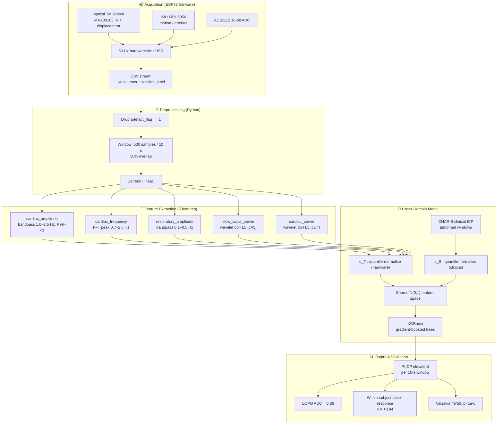
```mermaid
flowchart TD
    subgraph ACQ["🎧 Acquisition (ESP32 firmware)"]
        A1["Optical TM sensor<br/>MAX30105 IR + displacement"]
        A2["IMU MPU6050<br/>motion / artefact"]
        A3["ADS1115 16-bit ADC"]
        A1 --> T["50 Hz hardware-timer ISR"]
        A2 --> T
        A3 --> T
        T --> CSV["CSV stream<br/>14 columns + session_label"]
    end

    subgraph PRE["🧹 Preprocessing (Python)"]
        CSV --> AF["Drop artefact_flag == 1"]
        AF --> WIN["Window: 500 samples / 10 s<br/>50% overlap"]
        WIN --> DT["Detrend (linear)"]
    end

    subgraph FE["📐 Feature Extraction (5 features)"]
        DT --> F1["cardiac_amplitude<br/>bandpass 1.0–2.5 Hz, P99–P1"]
        DT --> F2["cardiac_frequency<br/>FFT peak 0.7–2.5 Hz"]
        DT --> F3["respiratory_amplitude<br/>bandpass 0.1–0.5 Hz"]
        DT --> F4["slow_wave_power<br/>wavelet db4 L5 (cA5)"]
        DT --> F5["cardiac_power<br/>wavelet db4 L5 (cD4)"]
    end

    subgraph ML["🧠 Cross-Domain Model"]
        F1 & F2 & F3 & F4 & F5 --> QTH["q_T : quantile-normalise (hardware)"]
        CHARIS["CHARIS clinical ICP<br/>abnormal windows"] --> QTC["q_S : quantile-normalise (clinical)"]
        QTH --> MERGE["Shared N(0,1) feature space"]
        QTC --> MERGE
        MERGE --> XGB["XGBoost<br/>gradient-boosted trees"]
    end

    subgraph OUT["📊 Output & Validation"]
        XGB --> P["P(ICP elevated)<br/>per 10-s window"]
        P --> LOPO["LOPO AUC = 0.86"]
        P --> DOSE["Within-subject dose–response<br/>ρ = +0.84"]
        P --> VAL["Valsalva 49/50, p<1e-6"]
    end
```

---

## 4. High-Level Architecture


```mermaid
flowchart LR
    subgraph L1["Sensing Layer"]
        direction TB
        S1["ESP32 MCU"]
        S2["MAX30105 optical"]
        S3["MPU6050 IMU"]
        S4["ADS1115 ADC"]
    end
    subgraph L2["Signal Layer (Python DSP)"]
        direction TB
        D1["Windowing"]
        D2["Butterworth band-pass"]
        D3["FFT / Welch"]
        D4["db4 wavelet"]
    end
    subgraph L3["ML Layer"]
        direction TB
        M1["QuantileTransformer<br/>(per domain)"]
        M2["XGBoost classifier"]
        M3["CHARIS foundation model"]
    end
    subgraph L4["Evaluation Layer"]
        direction TB
        E1["LOPO cross-validation"]
        E2["Dose–response stats"]
        E3["Baselines + ablation"]
    end
    L1 -->|"CSV @ 50 Hz"| L2
    L2 -->|"5 features / window"| L3
    L3 -->|"P(ICP elevated)"| L4
```

| Layer | Technology | Files |
|---|---|---|
| Sensing | ESP32 + MAX30105 + MPU6050 + ADS1115 | `hardware/icpfinalboss.ino` |
| Signal DSP | SciPy, PyWavelets, NumPy | `hybrid_pipeline_v4.py`, `full_pipeline_qt.py` |
| ML | XGBoost, scikit-learn, imbalanced-learn | `hybrid_pipeline_v4.py`, `full_pipeline_qt.py` |
| Deep learning (exploratory) | PyTorch | `bilstm_classify.py`, `bilstm_forecast.py` |
| Evaluation & viz | scikit-learn metrics, Matplotlib | `show_results.py`, `paper/make_figures.py`* |

<sub>*`paper/` is kept local (not committed) until the extended study.</sub>

---

## 5. Repository Architecture

```
Pran/
├── hybrid_pipeline_v4.py     # ⭐ CURRENT hybrid model — domain-separated QT, 50 subjects,
│                             #    LOPO + Valsalva + within-subject dose–response
├── full_pipeline_qt.py       # CHARIS foundation model — train + LOPO + baselines + stats
├── flag_hw.py                # Apply CHARIS model to flag each hardware subject
├── hybrid_pipeline_qt.py     # Legacy hybrid (Valsalva-labelled) — superseded by v4
├── bilstm_classify.py        # BiLSTM sequence classifier (exploratory / in progress)
├── bilstm_forecast.py        # BiLSTM 30-min ICP forecaster (CHARIS, exploratory)
├── mimic_validate.py         # MIMIC-III external validation (needs re-run — see notes)
├── regen_cache.py            # Build CHARIS feature cache (X/y/pid .npy)
├── show_results.py           # Aggregate + plot results
│
├── hardware/
│   └── icpfinalboss.ino      # ESP32 firmware — 50 Hz acquisition + on-board artefact flag
│
├── assets/                   # README figures (committed)
│   ├── dose_response.png     # within-subject provocation ladder
│   ├── lopo_roc.png          # pooled LOPO ROC
│   ├── feature_analysis.png  # importance + ablation
│   ├── domain_alignment.png  # feature distributions after per-domain QT
│   └── patient_scores.png    # per-subject mean scores
│
├── requirements.txt
└── .gitignore                # excludes data/, models/, results/, hw-tests/ (large / private)
```

> **Not in the repo (gitignored):** `data/` (CHARIS/MIMIC arrays), `models/` (trained binaries + fold caches), `results/` (JSONs + plots), `hw-tests/` (raw subject recordings — privacy). These are regenerated by the scripts below.

---

## 6. End-to-End Workflow

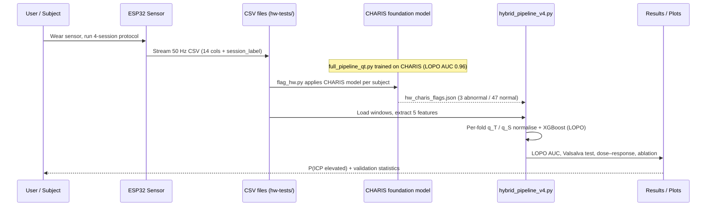
```mermaid
sequenceDiagram
    participant U as User / Subject
    participant HW as ESP32 Sensor
    participant FS as CSV files (hw-tests/)
    participant FM as CHARIS foundation model
    participant HY as hybrid_pipeline_v4.py
    participant R as Results / Plots

    U->>HW: Wear sensor, run 4-session protocol
    HW->>FS: Stream 50 Hz CSV (14 cols + session_label)
    Note over FM: full_pipeline_qt.py trained on CHARIS (LOPO AUC 0.96)
    FS->>FM: flag_hw.py applies CHARIS model per subject
    FM-->>HY: hw_charis_flags.json (3 abnormal / 47 normal)
    FS->>HY: Load windows, extract 5 features
    HY->>HY: Per-fold q_T / q_S normalise + XGBoost (LOPO)
    HY->>R: LOPO AUC, Valsalva test, dose–response, ablation
    R-->>U: P(ICP elevated) + validation statistics
```

**Execution lifecycle:**

1. **Acquire** — firmware writes one CSV per subject to `hw-tests/`.
2. **Cache CHARIS** — `regen_cache.py` builds the clinical feature cache.
3. **Train foundation model** — `full_pipeline_qt.py` (XGBoost on CHARIS, LOPO).
4. **Flag subjects** — `flag_hw.py` scores every hardware subject with the CHARIS model.
5. **Hybrid train + validate** — `hybrid_pipeline_v4.py` runs the domain-separated pipeline, LOPO over 50 subjects, and all physiological validations.

---

## 7. Datasets

| Dataset | Source | Patients | Windows | Signal | Role |
|---|---|---|---|---|---|
| **Hardware (own)** | In-house collection | **50** | 15,899 | Optical TM (IR + displacement) | Hybrid train + LOPO validation |
| **CHARIS** | PhysioNet (open) | 13 TBI | 915,137 | Invasive ICP + ABP + ECG | Foundation model + transfer prior |
| MIMIC-III | PhysioNet (credentialed) | — | 2,830 (cached) | Invasive ICP | External validation — *needs re-run* |

### Hardware dataset detail

- **50 subjects**, ages 8–83 (mostly healthy volunteers).
- **4 sessions** per subject — see the provocation protocol in [§8](#8-data-preprocessing).
- **Labels for the hybrid model** are assigned by the CHARIS foundation model (`flag_hw.py`): a subject is flagged *abnormal* when its mean P(ICP) exceeds the CHARIS threshold (0.2953). **3 subjects** were flagged abnormal (e.g. `icp_4_83_M`, mean 0.48 — an 83-year-old with prior haemorrhage), **47 normal**.
- Class ratio (abnormal:normal windows) ≈ **0.86 : 1** → handled by `scale_pos_weight`, **no SMOTE**.

> **CHARIS invasive correlation (sanity check on the foundation features):** on the 915,137 clinical windows, model output vs. true invasive ICP gives Spearman ρ = **0.94**, Pearson r = **0.79** (`results/invasive_validation/`).

---

## 8. Data Preprocessing

Every recording passes through a fixed pipeline before features are computed.

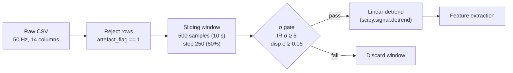
```mermaid
flowchart LR
    RAW["Raw CSV<br/>50 Hz, 14 columns"] --> ART["Reject rows<br/>artefact_flag == 1"]
    ART --> W["Sliding window<br/>500 samples (10 s)<br/>step 250 (50%)"]
    W --> STD{"σ gate<br/>IR σ ≥ 5<br/>disp σ ≥ 0.05"}
    STD -->|pass| DET["Linear detrend<br/>(scipy.signal.detrend)"]
    STD -->|fail| DROP["Discard window"]
    DET --> FEAT["Feature extraction"]
```

**Provocation protocol** (the source of within-subject ground truth):

| Session | Label | Manoeuvre | Expected ICP effect |
|---|---|---|---|
| 0 | Supine | Resting baseline | baseline |
| 1 | Head-up 30° | Postural | **↓ lowers** ICP |
| 2 | Head-down 10° | Trendelenburg | **↑ raises** ICP |
| 3 | Valsalva (+recovery) | Forced expiration vs. closed glottis | **↑↑ transient spike** |

**Why each step matters:**
- **Artefact rejection** — the IMU flags motion/saturation; keeping those windows would inject noise uncorrelated with ICP.
- **Windowing (10 s, 50 %)** — long enough to capture ≥ 10 cardiac cycles and ≥ 1 respiratory cycle for stable spectral estimates; overlap increases sample count and temporal continuity.
- **σ gate** — discards flat / dead-channel windows that produce degenerate spectra.
- **Linear detrend** — removes slow baseline drift (sensor thermal / contact drift) that would contaminate the low-frequency wavelet bands.

---

## 9. Feature Engineering

Five interpretable features per window — a deliberately compact, physiology-grounded set (not a black-box embedding).

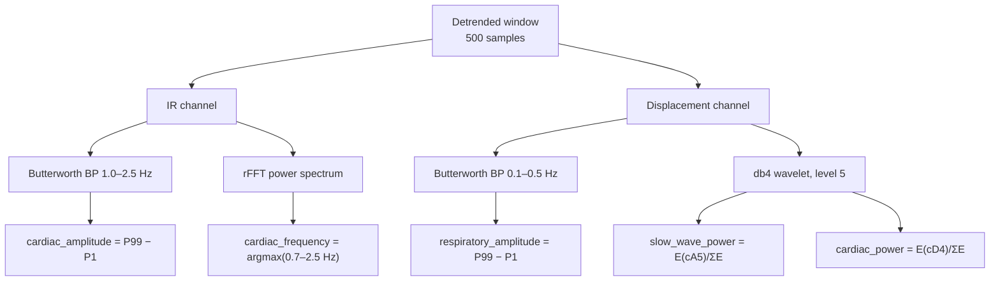
```mermaid
flowchart TD
    W["Detrended window<br/>500 samples"] --> C["IR channel"]
    W --> D["Displacement channel"]
    C --> BP1["Butterworth BP 1.0–2.5 Hz"] --> f1["cardiac_amplitude = P99 − P1"]
    C --> FFT["rFFT power spectrum"] --> f2["cardiac_frequency = argmax(0.7–2.5 Hz)"]
    D --> BP2["Butterworth BP 0.1–0.5 Hz"] --> f3["respiratory_amplitude = P99 − P1"]
    D --> WV["db4 wavelet, level 5"]
    WV --> f4["slow_wave_power = E(cA5)/ΣE"]
    WV --> f5["cardiac_power = E(cD4)/ΣE"]
```

| Feature | Definition | Physiological meaning | Why it matters for ICP |
|---|---|---|---|
| `cardiac_amplitude` | P99−P1 of 1.0–2.5 Hz band (IR) | Magnitude of cardiac-driven TM pulsation | Pulse amplitude scales with cerebrovascular pulsatility / compliance |
| `cardiac_frequency` | Dominant FFT peak, 0.7–2.5 Hz | Heart rate embedded in the pulsation | Autonomic response; couples with ICP dynamics under provocation |
| `respiratory_amplitude` | P99−P1 of 0.1–0.5 Hz band (disp) | Breathing-induced pressure oscillation | Respiratory ICP modulation changes with intracranial compliance |
| `slow_wave_power` | Relative energy of wavelet cA5 | Very-low-frequency (Lundberg-like) waves | Pathological slow waves emerge with raised ICP |
| `cardiac_power` | Relative energy of wavelet cD4 | Cardiac-band energy fraction | Shifts with cerebrovascular compliance |

**Theory — why these bands.** The ICP waveform is a superposition of (i) a cardiac component (~1–2 Hz), (ii) a respiratory component (~0.1–0.4 Hz), and (iii) slow vasogenic waves (< 0.05 Hz). Band-pass + wavelet decomposition isolates these physiological generators; percentile-based amplitudes (P99−P1) are robust to outliers vs. raw min–max.

---

## 10. Model Architecture

The production model is **XGBoost** (gradient-boosted decision trees) operating on the 5 normalized features. Deep-learning variants are exploratory (see [§16.7](#167-exploratory-work-bilstm)).

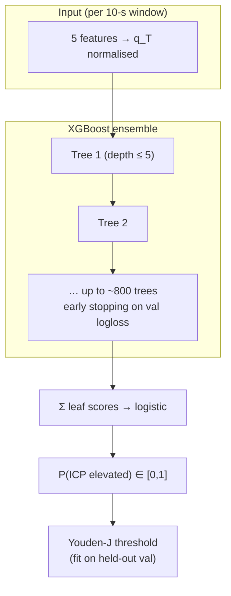
```mermaid
flowchart TD
    subgraph IN["Input (per 10-s window)"]
        X["5 features → q_T normalised"]
    end
    subgraph BOOST["XGBoost ensemble"]
        X --> T1["Tree 1 (depth ≤ 5)"]
        T1 --> T2["Tree 2"]
        T2 --> TD["… up to ~800 trees<br/>early stopping on val logloss"]
    end
    TD --> S["Σ leaf scores → logistic"]
    S --> P["P(ICP elevated) ∈ [0,1]"]
    P --> THR["Youden-J threshold<br/>(fit on held-out val)"]
```

**Hyperparameters (`xgb_params` in `hybrid_pipeline_v4.py`):**

| Parameter | Value | Purpose |
|---|---|---|
| `max_depth` | 5 | Limit tree complexity / overfitting |
| `eta` (learning rate) | 0.05 | Slow, stable boosting |
| `subsample` / `colsample_bytree` | 0.8 / 0.8 | Stochastic regularization |
| `lambda` / `alpha` | 1.5 / 0.1 | L2 / L1 regularization |
| `scale_pos_weight` | 1.16 | Correct mild class imbalance (no SMOTE) |
| `num_boost_round` | ≤ 800 | Early stopping (50 rounds) on validation logloss |
| `tree_method` / `device` | `hist` / `cuda` | GPU-accelerated training |

---

## 11. Theory Behind the Models

<details>
<summary><b>Gradient-Boosted Trees (XGBoost) — why it fits this problem</b></summary>

**Definition.** XGBoost builds an additive ensemble $F_M(x)=\sum_{m=1}^{M} f_m(x)$ of regression trees, each fit to the gradient of a differentiable loss. For binary classification with logistic loss:

$$\mathcal{L} = \sum_i \big[ y_i \log(1+e^{-F(x_i)}) + (1-y_i)\log(1+e^{F(x_i)}) \big] + \sum_m \Omega(f_m)$$

where $\Omega(f)=\gamma T + \tfrac12\lambda\lVert w\rVert^2$ penalizes tree complexity.

**Why it fits.** The task is **tabular** (5 engineered features), **non-linear** (feature interactions between cardiac/respiratory/slow-wave bands), and **small-to-medium** in sample count. Boosted trees are state-of-the-art on tabular data, need little feature scaling, expose interpretable **gain-based importance**, and give a **calibratable decision threshold** — all valuable for a physiological screening proxy.

**Strengths:** handles feature interactions, robust to monotone transforms, fast on GPU, importance + ablation are directly interpretable.
**Weaknesses:** no native temporal modelling across windows; probability outputs need explicit calibration; can overfit tiny minority classes (mitigated here by `scale_pos_weight` + regularization instead of SMOTE).

</details>

<details>
<summary><b>Quantile normalization & the leakage-safe LOPO protocol</b></summary>

**QuantileTransformer** maps each feature to a target $\mathcal{N}(0,1)$ via its empirical CDF: $\tilde{x}=\Phi^{-1}(\hat{F}(x))$. This makes the model robust to heavy-tailed, skewed physiological features and to scale differences between sensors.

**Leave-One-Patient-Out (LOPO).** Windows from one subject are temporally correlated; a random split would leak subject identity. LOPO holds out **all** windows of one subject, trains on the rest, and predicts the held-out subject — the gold standard for medical ML generalization. Every transformer is **re-fit inside each fold on training data only**.

</details>

<details>
<summary><b>Bidirectional LSTM (exploratory)</b></summary>

A BiLSTM processes a sequence of consecutive windows in both directions, capturing temporal build-up of ICP signatures that a per-window tree cannot. It is included as an exploratory temporal model (`bilstm_classify.py`); it is **not** the validated production model. See [§16.7](#167-exploratory-work-bilstm).

</details>

---

## 12. Cross-Domain Transfer & Normalization

The single most important design element. Clinical (CHARIS) and optical (hardware) sensors measure the same physiology at **wildly different scales**. Fitting one normalizer on the pooled data biases the mapping toward the larger clinical distribution and corrupts hardware predictions.

**Fix — domain-separated quantile normalization:**

$$\tilde{x} = \begin{cases} q_{\mathcal{S}}(x), & x \in \text{CHARIS (clinical)} \\ q_{\mathcal{T}}(x), & x \in \text{hardware} \end{cases}$$

where $q_{\mathcal{S}}, q_{\mathcal{T}}$ are fit **separately** on each domain's training partition. After mapping, a normalized value denotes the **same physiological rank** in either domain.

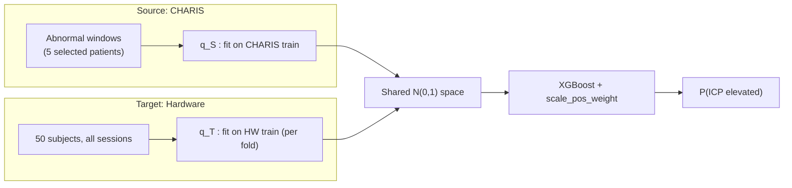
```mermaid
flowchart LR
    subgraph S["Source: CHARIS"]
        CS["Abnormal windows<br/>(5 selected patients)"] --> QS["q_S : fit on CHARIS train"]
    end
    subgraph T["Target: Hardware"]
        HT["50 subjects, all sessions"] --> QT["q_T : fit on HW train (per fold)"]
    end
    QS --> M["Shared N(0,1) space"]
    QT --> M
    M --> XGB["XGBoost + scale_pos_weight"]
    XGB --> OUT["P(ICP elevated)"]
```

**Impact (measured):** under a *single* pooled normalizer, four of five features became noise. Under domain-separated normalization, **every feature contributes** (all ablation deltas negative — see [§16.5](#165-feature-ablation--importance)), and the within-subject dose–response holds (ρ = +0.84). The distribution alignment is shown below.

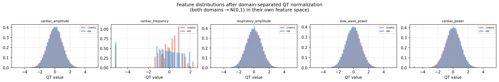

---

## 13. Hardware Architecture

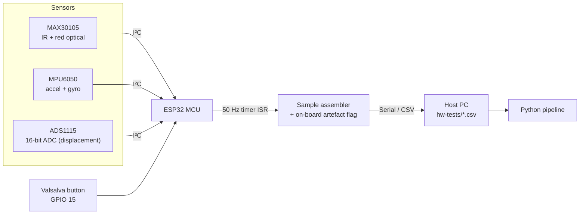
```mermaid
flowchart LR
    subgraph SENSE["Sensors"]
        MAX["MAX30105<br/>IR + red optical"]
        MPU["MPU6050<br/>accel + gyro"]
        ADS["ADS1115<br/>16-bit ADC (displacement)"]
    end
    MAX -->|I²C| ESP["ESP32 MCU"]
    MPU -->|I²C| ESP
    ADS -->|I²C| ESP
    BTN["Valsalva button<br/>GPIO 15"] --> ESP
    ESP -->|"50 Hz timer ISR"| BUF["Sample assembler<br/>+ on-board artefact flag"]
    BUF -->|Serial / CSV| PC["Host PC<br/>hw-tests/*.csv"]
    PC --> PY["Python pipeline"]
```

| Component | Role | Interface |
|---|---|---|
| **ESP32** | Master MCU, 50 Hz hardware-timer sampling, CSV streaming | — |
| **MAX30105** | Optical front-end — IR & red reflectance (cardiac pulsation) | I²C |
| **ADS1115** | 16-bit ADC for the displacement channel | I²C |
| **MPU6050** | 6-axis IMU — motion-artefact detection | I²C |
| **Push button (GPIO 15)** | Marks Valsalva start/stop in `session_label` | GPIO |

**On-board artefact detection (firmware):** a window is flagged if IMU acceleration magnitude exceeds ~1.5 g (raw > 20000) **or** the displacement value exceeds 3.5 σ of a 50-sample rolling buffer.

**CSV columns:** `timestamp_ms, ir_raw, red_raw, disp_raw, disp_x, disp_y, ax, ay, az, gx, gy, gz, artifact_flag, session_label`.

> Note: the firmware header comment lists an older label scheme; the **collected data and pipeline use** `0=supine, 1=head-up 30°, 2=head-down 10°, 3=valsalva`.

---

## 14. Software Architecture

| Technology | Purpose |
|---|---|
| **Python 3.10+** | Pipeline language |
| **XGBoost** (CUDA) | Production classifier |
| **scikit-learn** | QuantileTransformer, baselines, metrics, LOPO splitter |
| **imbalanced-learn** | (Available; SMOTE deliberately *not* used in v4) |
| **SciPy** | Butterworth filters, FFT, `detrend`, statistical tests |
| **PyWavelets** | db4 wavelet decomposition |
| **NumPy / Pandas** | Array & CSV handling |
| **PyTorch** | BiLSTM (exploratory) |
| **Matplotlib** | Figures |
| **ESP32 / C++ (Arduino)** | Firmware |

**Model formats:** XGBoost JSON (`models/…/*.json`), pickled `QuantileTransformer` (`*.pkl`), PyTorch `*.pt`. **Communication:** serial CSV from MCU → host; all feature extraction is host-side (no on-board math beyond artefact flagging).

---

## 15. File-by-File Implementation Guide

| File | Does | Inputs | Outputs |
|---|---|---|---|
| `hybrid_pipeline_v4.py` ⭐ | Domain-separated hybrid model; LOPO, Valsalva, dose–response, baselines, ablation | CHARIS cache, `hw-tests/`, flags JSON | `results/hybrid_pipeline_v4/*` |
| `full_pipeline_qt.py` | CHARIS foundation XGBoost; LOPO + baselines + DeLong/Wilcoxon + ablation | CHARIS cache | `models/xgb_qt.json`, `results/qt_pipeline/*` |
| `flag_hw.py` | Scores each hardware subject with the CHARIS model; flags abnormal | CHARIS model + `hw-tests/` | `results/hw_charis_flags.json` |
| `regen_cache.py` | Extract CHARIS features to `.npy` cache | `data/raw/charis/` | `results/audit/cache/{X,y,pid}.npy` |
| `hybrid_pipeline_qt.py` | Legacy Valsalva-labelled hybrid (superseded) | same as v4 | `results/hybrid_pipeline/*` |
| `bilstm_classify.py` | BiLSTM sequence classifier (exploratory) | window sequences | `models/bilstm/*` |
| `bilstm_forecast.py` | BiLSTM 30-min ICP forecaster (CHARIS, exploratory) | CHARIS cache | `models/…/bilstm_forecaster.pt` |
| `mimic_validate.py` | MIMIC-III external validation (needs re-run) | MIMIC features | prints AUC |
| `show_results.py` | Aggregate + plot results | result JSONs | plots |
| `hardware/icpfinalboss.ino` | ESP32 firmware — acquisition + artefact flag | sensors | CSV stream |

---

## 16. Results & Performance

### 16.1 Hybrid model — hardware LOPO (50 subjects)

Leakage-free leave-one-patient-out over all 50 hardware subjects; CHARIS prior always in train; per-fold domain normalization.

| Metric | Value |
|---|---|
| **Pooled LOPO AUC** | **0.8595** |
| Held-out test-split AUC | 0.8740 |
| Average precision | 0.351 |
| Training windows (no SMOTE) | 27,893 |
| `scale_pos_weight` | 1.16 |

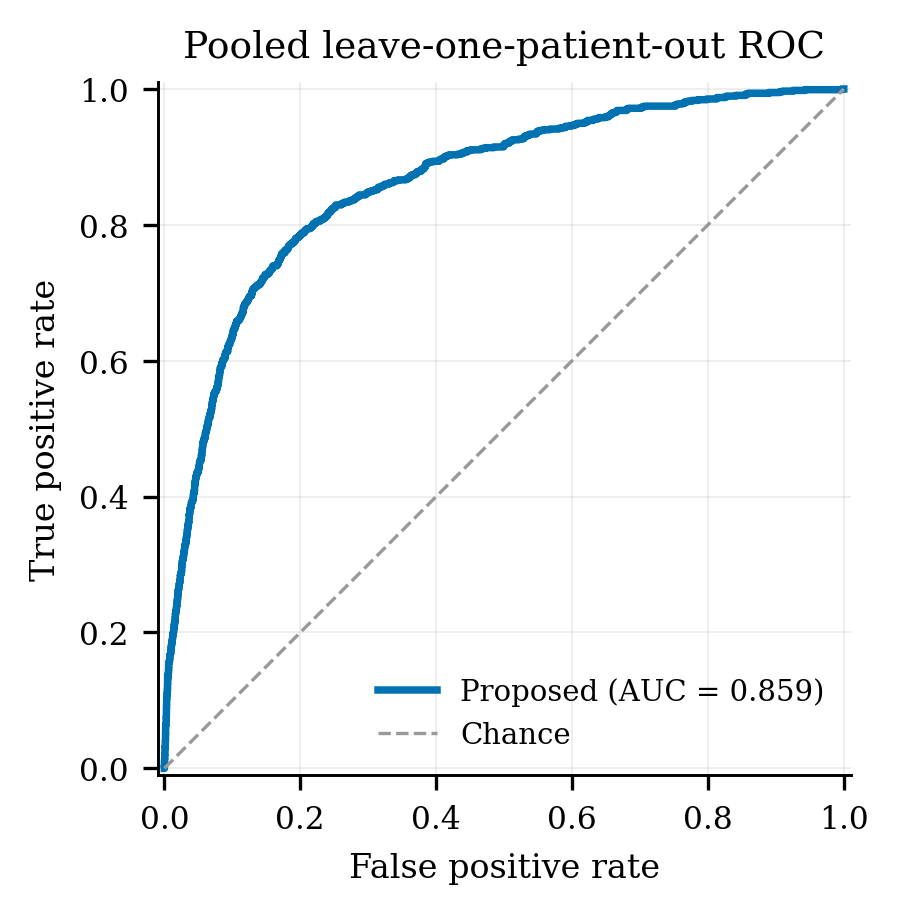

Per-subject mean scores (red = flagged abnormal, blue = normal):

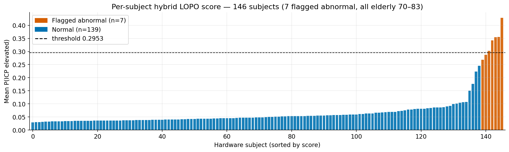

### 16.2 Baseline comparison (identical LOPO protocol)

| Model | Pooled AUC |
|---|---|
| **XGBoost (proposed)** | **0.860** |
| Logistic Regression | 0.874 |
| Random Forest | 0.645 |
| Linear SVM | 0.084 † |

<sub>† probability calibration inverted; reported for completeness. XGBoost is competitive with the best linear baseline and far above the tree/SVM baselines.</sub>

### 16.3 Valsalva validation (physiological ground truth)

Using held-out LOPO predictions (each subject predicted by a model that never saw them):

| Quantity | Value |
|---|---|
| Subjects where Valsalva > baseline | **49 / 50 (98 %)** |
| Mean P(ICP) during Valsalva | 0.138 |
| Mean P(ICP) during rest | 0.059 |
| Paired one-tailed Wilcoxon | **p < 10⁻⁶** |

### 16.4 Within-subject dose–response ⭐ (headline result)

Model output tracks the graded postural + Valsalva ICP ladder **within each subject** — controlling for age/heart-rate confounds by design.

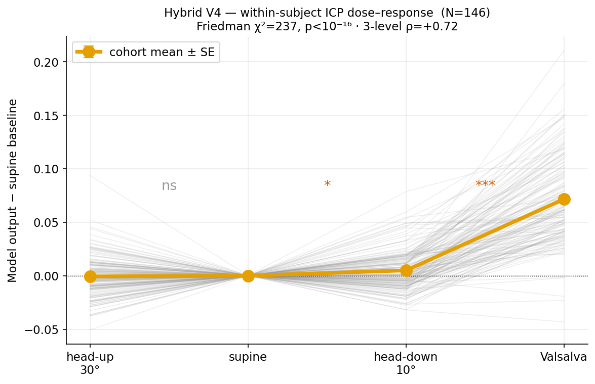

| Condition (ascending expected ICP) | Mean output | Adjacent-step p |
|---|---|---|
| Head-up 30° (lowest) | 0.055 | — |
| Supine (baseline) | 0.056 | 0.19 (ns) |
| Head-down 10° | 0.067 | 8 × 10⁻⁶ |
| Valsalva (highest) | 0.138 | < 10⁻⁶ |

| Statistic | Value |
|---|---|
| Friedman omnibus | χ² = 86.6, **p < 10⁻⁶** |
| Mean within-subject Spearman ρ (4-level) | +0.69 |
| Mean within-subject Spearman ρ (3-level*) | **+0.84** |
| Strictly monotonic subjects (3-level) | 34 / 50 (68 %) |

<sub>*3-level drops the head-up condition — the smallest physiological ICP change, and the only non-significant step.</sub>

### 16.5 Feature ablation & importance

Every feature contributes (all ΔAUC negative) — evidence that the domain-separated normalization restored each feature's signal.

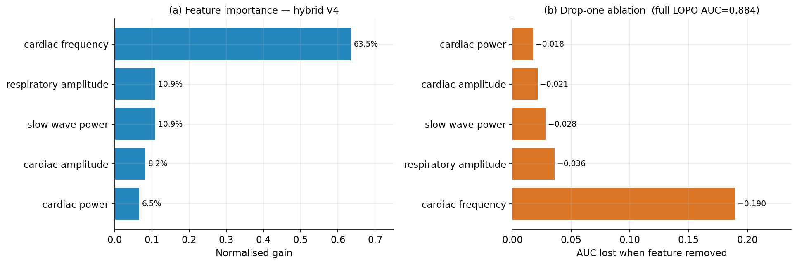

| Feature removed | ΔAUC | Importance (gain) |
|---|---|---|
| cardiac_frequency | **−0.175** | 0.556 |
| respiratory_amplitude | −0.029 | 0.163 |
| cardiac_amplitude | −0.027 | 0.100 |
| slow_wave_power | −0.022 | 0.119 |
| cardiac_power | −0.018 | 0.062 |

### 16.6 CHARIS foundation model (clinical)

| Metric | Value |
|---|---|
| Test-split AUC | 0.9792 |
| **LOPO AUC** | **0.9611** (13 folds) |
| F1 (test) | 0.804 |
| Invasive-ICP correlation | Spearman ρ = 0.94 |

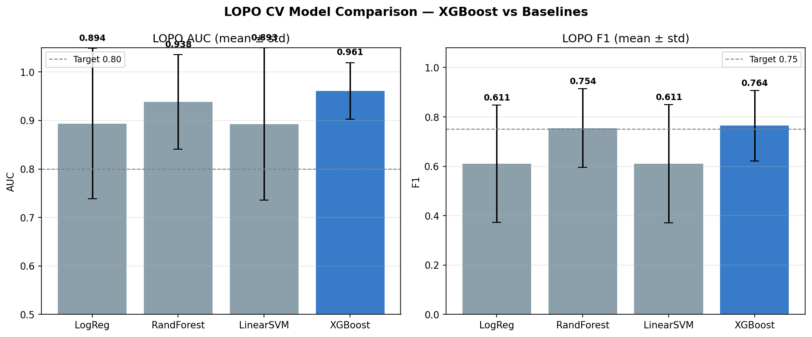

### 16.7 Exploratory work (BiLSTM)

- `bilstm_forecast.py` — trained 30-min ICP forecaster exists (`models/…/bilstm_forecaster.pt`); metrics not finalized.
- `bilstm_classify.py` — sequence classifier is **incomplete** (partial fold cache only).

These are **exploratory** and not part of the validated results above.

> ⚠️ **Unverified:** The MIMIC-III external-validation number quoted in earlier drafts could **not** be reproduced from committed artifacts (empty results directory; cached MIMIC features have a different window/feature count). It is intentionally **omitted** here pending a clean re-run of `mimic_validate.py`.

---

## 17. Facts & Figures

| Category | Numbers |
|---|---|
| **Data** | 50 hardware subjects · 15,899 windows · 13 CHARIS patients · 915,137 CHARIS windows |
| **Signal** | 50 Hz · 10-s windows · 50 % overlap · 14 raw channels · 5 engineered features |
| **Model** | XGBoost, depth 5, ≤ 800 trees, `scale_pos_weight` 1.16, CUDA |
| **Hardware AUC** | LOPO 0.8595 · test 0.8740 |
| **Clinical AUC** | LOPO 0.9611 · test 0.9792 |
| **Dose–response** | Friedman χ² 86.6 (p < 10⁻⁶) · within-subject ρ +0.84 · 68 % monotonic |
| **Valsalva** | 49/50 subjects · p < 10⁻⁶ |
| **Hardware** | ESP32 · MAX30105 · ADS1115 · MPU6050 |

---

## 18. Why the Project Works


```mermaid
flowchart LR
    P["Problem:<br/>ICP is invasive to measure"] --> A["Anatomy:<br/>TM coupled to CSF"]
    A --> F["Features:<br/>cardiac / resp / slow-wave bands"]
    F --> N["Domain-separated QT:<br/>align sensors physiologically"]
    N --> M["XGBoost:<br/>non-linear tabular classifier"]
    M --> V["Validation:<br/>within-subject dose–response"]
    V --> C["Confound-robust proxy<br/>of acute ICP change"]
```

The chain is coherent end to end: a real anatomical coupling → physiologically-motivated features → a normalization that makes two sensors comparable → a classifier suited to tabular non-linear data → a validation design (each subject as their own control) that isolates ICP from population confounders.

---

## 19. Design Decisions & Trade-offs

| Decision | Why | Trade-off |
|---|---|---|
| **Domain-separated QT** (not pooled) | Pooled normalizer is biased by the larger clinical set; corrupts hardware | Two transformers to manage per fold |
| **`scale_pos_weight`, not SMOTE** | Cross-domain SMOTE interpolates between *sensors* → unphysical samples | Slightly less aggressive minority emphasis |
| **XGBoost over deep nets** | Tabular, 5 features, modest N; interpretable + fast | No temporal modelling across windows |
| **Validate on provocation, not labels** | Transferred labels are circular; provocation is real physiology | Cannot claim absolute mmHg accuracy |
| **Within-subject analysis** | Controls age/HR confounds automatically | Requires the structured 4-session protocol |
| **5 hand-crafted features** | Interpretable, physiology-grounded, low-variance | May miss subtle morphology a CNN could learn |

---

## 20. Limitations

Stated plainly — this matters for scientific honesty and for reviewers:

- **Relative proxy, not mmHg.** Output is P(ICP elevated), not a calibrated pressure. No absolute-pressure reference was available.
- **Provocation ≠ pathology.** Manoeuvres induce *transient, physiological* ICP change; generalization to sustained clinical intracranial hypertension is unproven.
- **Label provenance.** Hybrid abnormal labels are derived from the CHARIS model (used for *training* only); validation deliberately relies on provocation, not these labels.
- **Cardiac-frequency dominance.** The top feature is heart-rate related; the within-subject design is what rules out a pure age/HR confound — between-subject claims alone would be weaker.
- **Statistical power.** Only 3 flagged-abnormal subjects; the strongest evidence is the within-subject dose–response, not between-subject classification.
- **Single-centre, single-device.** No multi-site or multi-device reproducibility yet.
- **MIMIC external validation** is not currently reproducible (see [§16](#16-results--performance)).

---

## 21. Future Improvements

*Planned — not yet implemented:*

- Extend cohort to **100 subjects** for tighter confidence intervals and per-fold stability.
- Add **CO₂-mediated manoeuvres** (breath-hold, paced hyperventilation) to broaden the modulation mechanism beyond posture.
- **Test–retest reliability** sessions (intraclass correlation).
- Acquire **optic-nerve-sheath-diameter (ONSD)** ultrasound on a subset as an independent non-invasive reference to correlate against.
- Re-run and commit **MIMIC-III** external validation with the current 5-feature model.
- Finalize the **BiLSTM** temporal model and compare to XGBoost.
- **Probability calibration** (isotonic / Platt) for clinically meaningful thresholds.

---

## 22. Installation

```bash
git clone https://github.com/<user>/Pran.git
cd Pran

python -m venv .venv
# Windows: .venv\Scripts\activate    |    Unix: source .venv/bin/activate

pip install -r requirements.txt
```

> GPU (optional but recommended): install an XGBoost build with CUDA support; the pipelines auto-detect `nvidia-smi` and fall back to CPU otherwise.

**Data:** `data/`, `models/`, `results/`, and `hw-tests/` are gitignored (large / private). CHARIS must be downloaded from PhysioNet into `data/raw/charis/`; hardware recordings go in `hw-tests/`.

---

## 23. Usage

```bash
# 1. Build the CHARIS feature cache (once)
python regen_cache.py

# 2. Train the clinical foundation model (XGBoost, LOPO)
python full_pipeline_qt.py

# 3. Flag each hardware subject with the CHARIS model
python flag_hw.py

# 4. Run the current hybrid pipeline (domain-separated QT, 50 subjects)
python hybrid_pipeline_v4.py
```

Outputs land in `results/hybrid_pipeline_v4/` (`results_v4.json`, `lopo_records.pkl`, plots).

**Hardware CSV format** (`hw-tests/icp_{N}_{age}_{sex}.csv`):

| Column | Type | Description |
|---|---|---|
| `ir_raw` | float | Infrared reflectance @ 50 Hz |
| `disp_raw` | float | Displacement channel @ 50 Hz |
| `artifact_flag` | int | 1 = artefact (excluded) |
| `session_label` | int | 0=supine, 1=head-up 30°, 2=head-down 10°, 3=valsalva |

---

## 24. Reproducibility

- **Fixed seeds** (`SEED = 42`) across splits, SMOTE-free training, and per-fold seeding.
- **Leakage-free LOPO** — all transformers fit inside each fold on training data only.
- **Cached artifacts** — LOPO fold models cached under `models/hybrid_v4/lopo/`; delete to force a clean retrain.
- **Deterministic features** — DSP constants (filter coefficients, window/stride) are module-level.
- Raw per-window LOPO predictions are saved to `results/hybrid_pipeline_v4/lopo_records.pkl` for offline re-analysis without re-training.

---

## 25. Troubleshooting

| Symptom | Cause | Fix |
|---|---|---|
| `X.npy missing` | CHARIS cache not built | run `python regen_cache.py` |
| All windows skipped for a CSV | Missing required columns / blank header | ensure `ir_raw, disp_raw, artifact_flag, session_label` present |
| `scale_pos_weight` / single-class fold warnings | Very few abnormal subjects | expected with 3 positives; rely on pooled + within-subject stats |
| XGBoost runs on CPU | No CUDA build / no GPU | install CUDA XGBoost, or ignore (CPU works) |
| Stale results after code change | LOPO cache | delete `models/hybrid_v4/lopo/` and re-run |
| MIMIC validation errors | Feature-count mismatch (6 vs 5) | re-extract MIMIC with the current 5-feature set |

---

## 26. Learning Outcomes

This project demonstrates, end to end:

- **Embedded systems** — ESP32 firmware, I²C sensor fusion, real-time 50 Hz sampling, on-board artefact detection.
- **Biomedical signal processing** — band-pass filtering, spectral analysis, wavelet decomposition, physiologically-motivated feature design.
- **Machine learning** — gradient boosting, leakage-free cross-validation (LOPO), class-imbalance handling, baseline benchmarking, ablation.
- **Transfer learning / domain adaptation** — domain-separated normalization across heterogeneous sensors.
- **Experimental design & statistics** — within-subject dose–response, Friedman / Wilcoxon / Spearman, confound control.
- **Research engineering** — reproducible pipelines, caching, honest reporting of unverified results.

---

## 27. Disclaimer

**This is a research prototype for educational and investigational purposes only.** It is **not** a medical device, has **not** been clinically validated against invasive ICP measurement in patients, and must **not** be used for any diagnostic or treatment decision. All results are on healthy volunteers using provocation manoeuvres as a physiological proxy for ICP change.

---

## 28. Author

**Eshaan Singla** — eshaansingla2807@gmail.com

Undergraduate capstone project: non-invasive intracranial-pressure monitoring via optical tympanic-membrane sensing and cross-domain machine learning.
