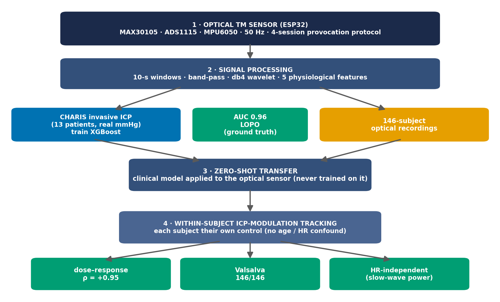

# Pran: Optical Eardrum Sensor for ICP-Related State Recognition

**A low-cost optical eardrum sensor, a clinical model trained on public patient data, and an honest test of what each can and cannot show.**

> **Scope (read first).** The hardware model **recognises the recorded physiological state** (Valsalva manoeuvre, posture) from optical features. It is **not** an ICP measurement, is **not** calibrated to mmHg, and is **not** a diagnostic device. There are no patients with raised ICP in the hardware data. The clinical (CHARIS) model does **not** transfer to the hardware.



## At a glance

| | |
|---|---|
| Hardware recordings | **146 volunteers**, ages 7 to 83 (median 21), 107 M / 39 F, **46,407** ten-second windows, four sessions each (supine, head-up 30°, head-down 10°, Valsalva), fixed order |
| Sensor | ESP32 + infrared optical sensor (MAX30105) + 16-bit ADC (ADS1115) + motion sensor (MPU6050), 50 Hz |
| Public data | **CHARIS** (PhysioNet): 13 brain-injury patients with an invasive ICP probe, 915,137 windows |
| **Hardware model** | XGBoost on 32 optical features. Valsalva recognition on **unseen subjects**: **AUC 0.995**, sensitivity 0.964, specificity 0.960, precision 0.888, F1 0.925 |
| **CHARIS-only model** | XGBoost. Leave-one-patient-out **AUC 0.961** (95% CI 0.924 to 0.985) with the original features; **0.693** (0.626 to 0.756) after removing mean-level information |
| Transfer CHARIS to hardware | **No.** Five alignment attempts, Valsalva-vs-supine AUC 0.53 to 0.66 |

## Results

### 1. Hardware model: recognising the Valsalva state
Valsalva windows are labelled abnormal and all other windows normal. Everything is evaluated with **subject-grouped 13-fold cross-validation** (no subject in both training and testing); the decision threshold is chosen on separate validation subjects inside each training set.

| Metric | Single 10 s window | Trailing 35 s average |
|---|---|---|
| AUC | 0.995 | 0.998 |
| Average precision (chance 0.248) | 0.984 | 0.994 |
| Sensitivity / specificity | 0.964 / 0.960 | 0.974 / 0.968 |
| Precision / F1 | 0.888 / 0.925 | 0.909 / 0.940 |
| Balanced accuracy | 0.962 | 0.971 |
| Accuracy (always-normal scores 0.752) | 0.961 | 0.969 |

- Whole-session view: the Valsalva session is the highest-scoring of a subject's four sessions in **146 / 146** subjects (session AUC 1.0).
- ICP-ordered ladder (head-up < supine < head-down < Valsalva): holds in **146 / 146** subjects (chance 4%). Head-up scores below supine in every subject, the opposite of recording order.
- Several model families give the same picture on identical folds (AUC): XGBoost 0.995, HistGradientBoosting 0.994, MLP 0.993, Random Forest 0.990, Extra Trees 0.990, Logistic Regression 0.978.

**Checks that could have broken it**

| Check | Result |
|---|---|
| Subjects shared between train and test | None in every fold (asserted in code) |
| Label-shuffle null | AUC 0.497 (chance) |
| Train vs held-out gap | AUC 0.999 vs 0.995 |
| Hold out contiguous subject-ID blocks (recording batches) | AUC 0.992, worst block 0.981 |
| Train on early IDs, test on late (and reverse) | 0.992 / 0.988 |
| Slow drift: first vs second half of one session | AUC 0.52 to 0.62 |
| Body movement: motion sensor alone | AUC 0.695; optical AUC stays 0.995 in each subject's quietest 25% of windows |
| Relative band powers only (no amplitude features) | AUC 0.958 |
| One channel at a time (band powers only) | IR 0.914, red 0.910, displacement 0.720 |

**What this does and does not show.** The signal recognises the recorded state. It cannot separate ICP from other things that change with posture and straining (head angle, blood pressure, venous return); the IR and red channels alone each reach about 0.91, so systemic blood-flow effects are part of what is recognised.

A simple model-free view agrees ([details](docs/HARDWARE_RESULTS.md)): compared with each person's own supine baseline, `slow_wave_power` rises by **+1.19** baseline SDs during Valsalva in 146 / 146 subjects and by +0.24 in head-down (99%); head-up shows no effect. The Valsalva response is smaller in the 65+ group (+0.55 vs +1.0 to +1.5 in the other age bands, 14 people; cause unknown).


### 2. CHARIS-only model (public data)
| | |
|---|---|
| Original features, leave-one-patient-out AUC | **0.961** (95% CI 0.924 to 0.985) |
| Held-out test patients | AUC 0.979, recall 0.876, specificity 0.956, precision 0.743, F1 0.804 |
| Baselines (leave-one-patient-out) | Random Forest 0.938, Logistic Regression 0.894, SVM 0.893 |
| **After removing mean-level information** | **0.693** (0.626 to 0.756); Random Forest 0.689, Logistic Regression 0.668 |

**Why two numbers.** In the original features the wavelet energy ratios were computed on windows that still contained the average pressure level, which also defines the label. With that removed the AUC is about 0.69 and XGBoost is not clearly better than simpler models. Both are reported.

### 3. Does the CHARIS model transfer to the hardware?
No. Valsalva-vs-supine AUC on hardware windows (0.5 is chance): as first built 0.656, unit-free features 0.648, per-subject rank alignment 0.587, rank alignment 0.572, unit change 0.560, joint distribution mapping 0.529. Two of the five features change in opposite directions between the datasets, which rescaling cannot fix. A combined (hybrid) model does no better than the hardware model alone.

## Limitations
- State recognition only: no ICP reference, no calibration to mmHg, no patients with raised ICP in the hardware data.
- Manoeuvre order was fixed. Checks against drift and movement are above, but randomised order would settle it.
- IR and red channels each carry most of the signal, so the eardrum-specific part is not isolated (displacement band powers alone reach 0.72).
- The Valsalva block is several minutes long while one Valsalva effort lasts seconds, so some windows labelled Valsalva may be rest.
- Single site, single device, mostly young volunteers; only 13 CHARIS patients.

## Repository layout
```
app.py, predict.py     web app and command-line inference for the hardware model
pran/                  shared feature extraction and the hardware model (training, thresholds, scoring)
templates/, static/    the app's pages and stylesheet
charis/                CHARIS feature cache and the CHARIS-only XGBoost pipeline
hardware/              ESP32 firmware
docs/                  model-free hardware analysis
assets/                figures used above
support/               experiments, checks and earlier work (git-ignored; see support/MANIFEST.md)
```
`data/`, `models/`, `results/`, `hw-tests/` (private recordings) and `support/` are git-ignored.

## Quick start
```bash
pip install -r requirements.txt

# CHARIS-only model (download CHARIS from PhysioNet into data/raw/charis/)
python charis/regen_cache.py
python charis/full_pipeline_qt.py

# Hardware model (needs the recordings in hw-tests/, files icp_{N}_{age}_{sex}.csv)
python -m pran.hardware_model          # extracts features, cross-validates, trains, writes models/hardware/

# Use it
python predict.py hw-tests/icp_100_20_M.csv
python app.py                          # web app at http://127.0.0.1:5000
```
Hardware CSV columns: `timestamp_ms, ir_raw, red_raw, disp_raw, disp_x, disp_y, ax, ay, az, gx, gy, gz, artifact_flag, session_label` (`session_label`: 0 supine, 1 head-up 30°, 2 head-down 10°, 3 Valsalva). The motion columns are recorded but not used by the model.

## Reproducibility
Fixed seeds (`SEED = 42`), subject-grouped splits, thresholds chosen only on validation subjects, no synthetic oversampling in the hardware model. `python -m pran.hardware_model` rebuilds every hardware number above from the raw recordings.

## References
- Prabhakar H, Bithal PK, Suri A, Rath GP, Dash HH. Intracranial pressure changes during Valsalva manoeuvre in patients undergoing a neuroendoscopic procedure. *Minim Invasive Neurosurg*, 2007. PMID 17674296.
- Dhar R, Sandler RH, Manwaring K, Kostick N, Mansy HA. Noninvasive detection of elevated ICP using spontaneous tympanic membrane pulsation. *Sci Rep* 2021;11:21957.
- Gwer S, Sheward V, Birch A, et al. The tympanic membrane displacement analyser for monitoring intracranial pressure in children. *Childs Nerv Syst* 2013;29:927-933.
- CHARIS database, PhysioNet.

## Disclaimer
Research prototype for educational and investigational use. Not a medical device and not validated for any diagnostic or treatment decision. All hardware data are from healthy volunteers doing physiological manoeuvres.

## Author
**Eshaan Singla**: eshaansingla2807@gmail.com. Undergraduate capstone project.
