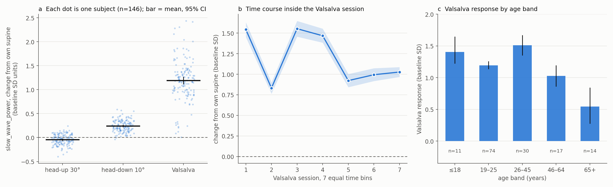

# Hardware results (146 subjects): model-free baseline analysis

> This page covers the simple, model-free analysis of one feature (`slow_wave_power`) against each subject's own supine baseline. The final hardware model (32 optical features, AUC 0.995 on unseen subjects) and its validity checks are in the README and on the app's Results page.

**Scope.** This is a *within-subject* response study of the optical eardrum sensor. Every number below compares a person with their **own supine baseline**. It does not measure or predict absolute ICP, it is not calibrated to mmHg, and it does not detect abnormal ICP. Manoeuvre order was fixed (supine → head-up → head-down → Valsalva) and there is no reference ICP measurement.

## 1. Personal-baseline index (no model, no training)
Index = (session mean − subject's own supine mean) ÷ subject's own supine SD, for `slow_wave_power`.

| Manoeuvre | Mean (95% CI) | Subjects with a rise | Wilcoxon p |
|---|---|---|---|
| head-up 30° | -0.04 (-0.06, -0.03) | 36% | 2.8e-05 |
| head-down 10° | +0.24 (+0.22, +0.26) | 99% | <1e-15 |
| Valsalva | +1.19 (+1.12, +1.26) | 100% | <1e-15 |

Valsalva session mean above the subject's own supine mean: **146/146 subjects** (95% Clopper–Pearson 0.975–1.000). Head-up shows no effect, so a graded head-up < supine < head-down ladder is **not** supported.

`slow_wave_power` was singled out because it showed the clearest effect in this cohort, so its effect size is optimistic. The full table for all five features, including the ones that go the other way, is in `results/hardware_results.json` (`baseline_index`).

## 2. Window-level discrimination, honestly estimated
Within-subject AUC of one 10-second window against the same subject's baseline windows. The feature and its sign are chosen **inside training subjects only** (13-fold subject cross-validation).

| Task | CV AUC (95% CI) | Subjects above 0.5 |
|---|---|---|
| Valsalva vs supine | 0.713 (0.704, 0.720) | 100% |
| head-down+Valsalva vs supine+head-up | 0.651 (0.644, 0.656) | 100% |
| head-down vs supine | 0.562 (0.557, 0.568) | 97% |

## 3. Time course inside the Valsalva session
`slow_wave_power` relative to the subject's own supine baseline, over 7 equal time bins of the session (n = 146):

| Bin | 1 | 2 | 3 | 4 | 5 | 6 | 7 |
|---|---|---|---|---|---|---|---|
| Mean | +1.54 | +0.83 | +1.55 | +1.47 | +0.92 | +0.99 | +1.03 |
| Above baseline | 98% | 99% | 99% | 100% | 96% | 99% | 100% |

The response is above baseline throughout and settles lower by the last bin (first vs last bin, Wilcoxon p = <1e-15). A pure monotonic drift would keep rising, so this pattern favours a response tied to the manoeuvre. It does not rule out drift entirely, because the signal stays elevated to the end. The internal protocol of the 7-minute block (number of efforts, hold times, rests) is not recorded in the data.

## 4. Age and sex
Valsalva response (`slow_wave_power`, baseline SD units):

| Age band | n | Mean (95% CI) | Subjects with a rise |
|---|---|---|---|
| ≤18 | 11 | +1.41 (+1.23, +1.64) | 100% |
| 19–25 | 74 | +1.19 (+1.14, +1.25) | 100% |
| 26–45 | 30 | +1.51 (+1.35, +1.66) | 100% |
| 46–64 | 17 | +1.02 (+0.86, +1.19) | 100% |
| 65+ | 14 | +0.55 (+0.28, +0.84) | 100% |

| Sex | n | Mean (95% CI) | Subjects with a rise |
|---|---|---|---|
| M | 107 | +1.19 (+1.12, +1.26) | 100% |
| F | 39 | +1.19 (+1.02, +1.37) | 100% |

Age vs Valsalva response: Spearman ρ = -0.15 (p = 6.3e-02); across age bands Kruskal–Wallis p = 1.3e-06; sex difference Mann–Whitney p = 9.9e-01. The response is present in every band, but the 65+ band is clearly smaller (+0.55 vs +1.02 to +1.51 in the other bands). The data does not say why. The cohort is young (median age 21), so the older bands are small (n = 14 and 17).

## Limits
- Fixed manoeuvre order: time and drift are confounded with the manoeuvre.
- No reference ICP: relative response only, not mmHg and not abnormal-ICP detection.
- Single site, single device, mostly young volunteers.
